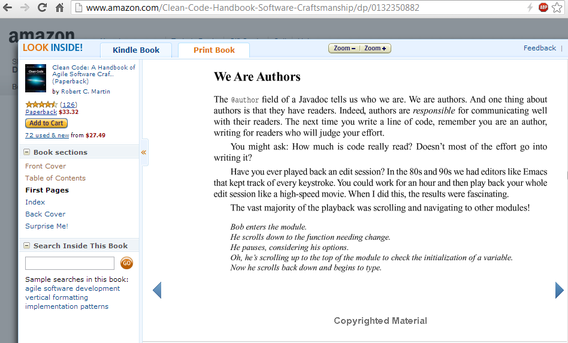
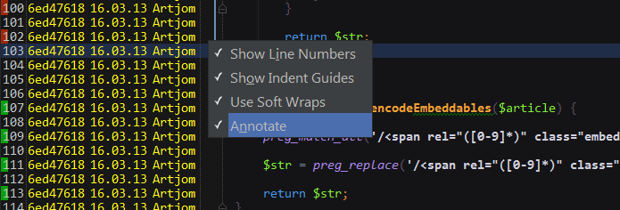

пятница, 29 марта 2013 г. в 10:29:02

Недавно [опросил коллег](https://www.facebook.com/groups/219298153773/permalink/10151495718608774/) по поводу использования [@author](http://www.phpdoc.org/docs/latest/for-users/phpdoc/tags/author.html) аннотаций в коде. Большинство категорично накинулись что мол де, для этого есть VCS. Саня Мочёнов даже [пристыдил](https://vimeo.com/62849104#t=29m10s) что я не умею и мне лень ими пользоваться. Оокей..

<!-- truncate -->

### Авторство как ответственность

Спросил я не просто так, а потому что [дядюшка Боб](https://twitter.com/unclebobmartin) советует явно указывать авторство как проявление ответственности, открытости, профессионализма. Конечно тут может встать вопрос а не устарел ли его совет в практической форме..

В идеале хорошо если код пишется тесной командой  где есть взаимные проверки, тесты, форматы кода. Тогда да, файлы могут часто меняться и это одеяло всюду в заплатках, смысла в одинокой @author аннотации наверху не имеет особого смысла и можно действительно напрямую смотреть VCS. И в PHPStorm интеграция с git выглядит тогда так..

Но на моём опыте, классы изначально пишутся одним человеком. Он - архитектор. Последующие поколения, пришедшие на обустроенный им ландшафт с большим трудом могут сделать кардинальный рефакторинг в работающем городе, поэтому от того как он выбирает используемую терминологию, структуру методов, порядок их вызовов, схему таблиц БД, напрямую зависит качество и успешность будущего продукта. Поэтому я вижу смысл указывать отца-основателя или же главного виновника всех бед в шапке комментариев.

На практике же я часто вижу что код полу-анонимный, особенно если используется SVN. Поднимать историю ревизий конкретного файла через blame, что-бы узнать кого спросить про баги или способы использование — неэффективно. Более того, такой сумрак и отсутсвие авторства подсознательно влияет на порядок в целом

1. если к тебе в дом никто в гости не ходит, значит не обязательно наводить порядок (класс мой, что хочу то ворочу)  
2. если за улицей никто не следит, то мусорить можно (код чужой и никому не нужен)

### Авторство как авторитет

Программисты — инженеры и интересуются техническими возможностями системы, сложностью структуры данных и бегающих процессов. Их как-то мало волнует реклама, юристы, имидж. Это хорошо, потому что судишь человека по поступкам в жизни, а не по тому как он выглядит. Но в большинстве своём, доступ к этим поступкам выраженных в коде, закрыт корпоративными стенами и хранятся в тени местных VCS, где через несколько лет умирают, потому что код  развивающихся web-продуктов мимолётен.

Таким образом иметь @author хотя-бы в javascript файле на корпоративном сайте - уже признание. Аналогична инициатива [humans.txt](http://humanstxt.org/RU), открыть авторство сайтов для публики. 

Но и это выглядит всё ещё жалким отражением того признания которое может дать компания своему программисту - повесить его имя у себя на сайте. Большинство компаний не уважают себя настолько, что-бы заботится о своей истории и программистах и публично признавать их авторство или **принадлежность компании**, в том числе уже не состоящих в штате.

Как мне кажется, их оправдание - клиентам не важны программисты, они ведь общаются только с _proektijuht_'ами, т.е. менеджерами. И вообще, они расходный материал - только обустраиваются, не успеваешь их сфотографировать, как увольняются.. смысл следить за культурой?

Понятно что без культуры **сохранения памяти** об историческом вкладе работника, невозможно просто построить оценку компетентности работника на всём рынке. Именно поэтому каждый раз при устройстве на работу вам дают унизительное тестовое задание на бумажке - докажи за час, что ты не осёл. И именно поэтому так популярны [github](https://github.com/) и opensource для программистов, [grabcad](http://grabcad.com/) для механиков и linkedin для капиталистов в целом. 

Но заметьте, что на гитхабе во главе стоит индивид, а не компания. Значит ли это что в @author должна быть личная почта, а не корпоративная? Имеет ли вообще смысл писать почту, ведь кто реально будет с вами связываться? Вот мы и приходим к проблеме википедии и OAuth - ни имя в git repo, ни почта не идентифицируют человека глобально. Это могут делать только феодальные компании-государства и подтверждать авторство, как пасспорта между собой.

Улучшайте код, не стесняйтесь своего имени и выбирайте открытые компании