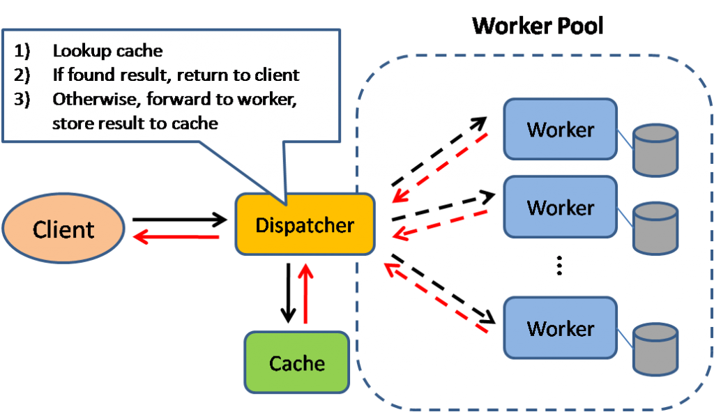
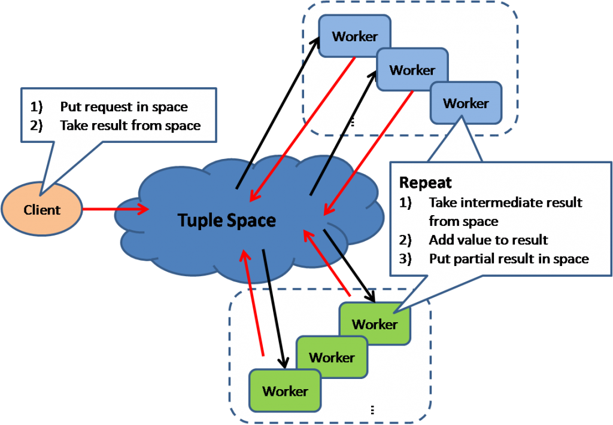
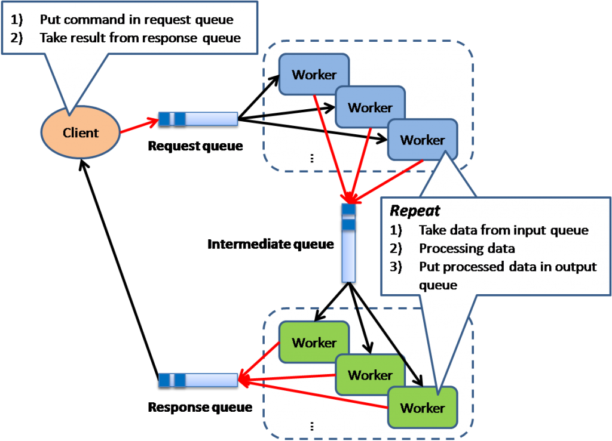
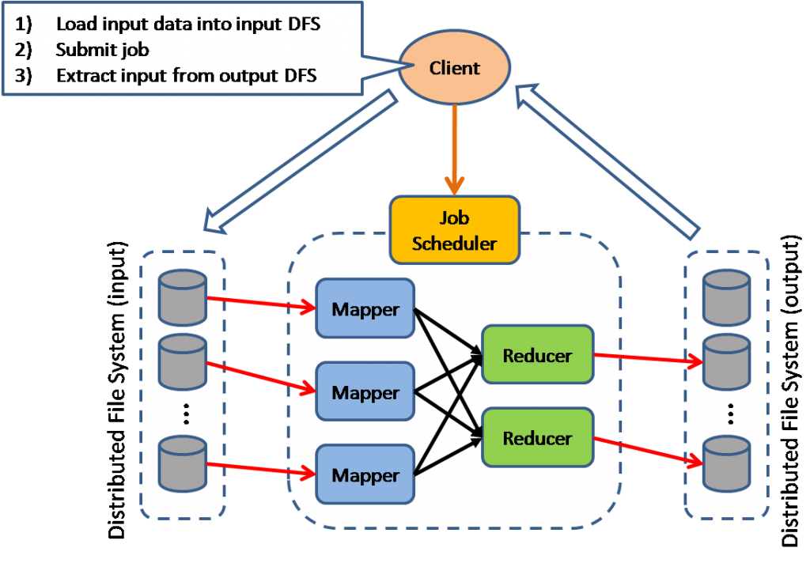
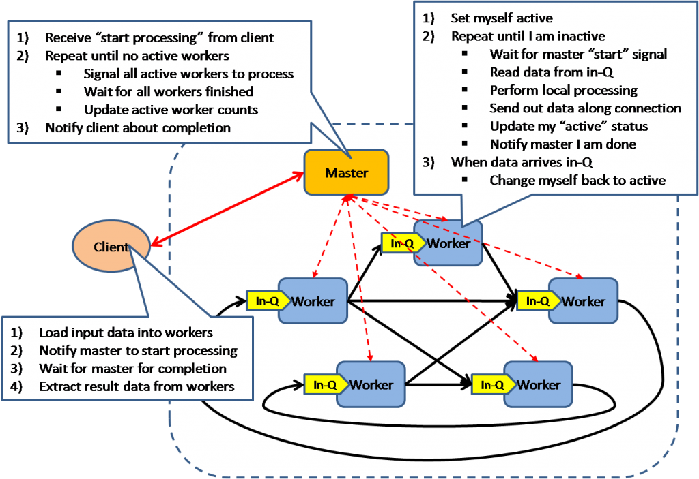
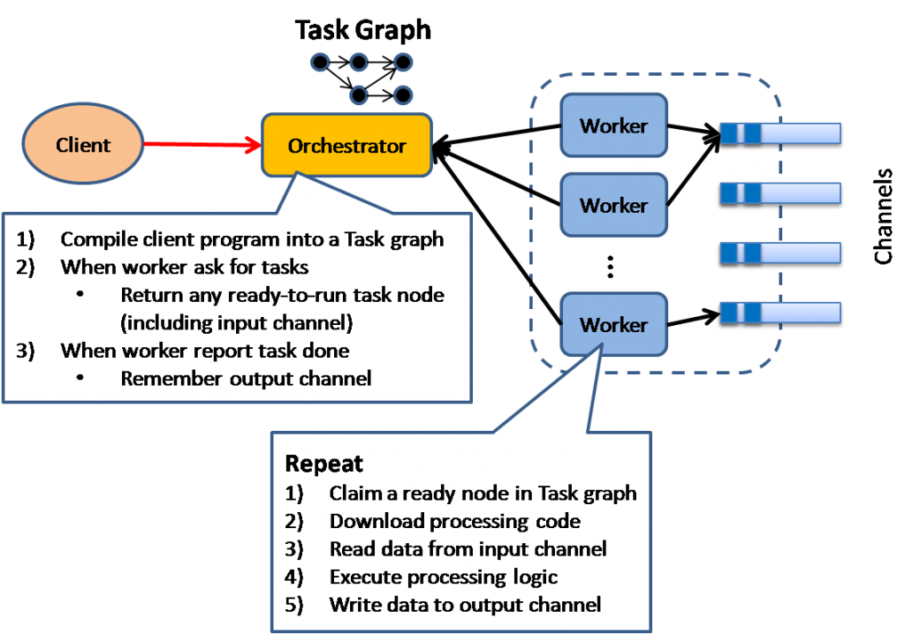

Это вольный перевод и дополнения [статьи Ricky Ho](http://horicky.blogspot.com/2010/10/scalable-system-design-patterns.html) на англицком об алгоритмах используемых в масштабировании систем и распределённом вычислении. Обратите внимание что эти модели применимы не только в программировании, но и в управлении.  

<!-- truncate -->

### Балансировщик нагрузки

В этой простейшей модели центральный узел (балансировщик) определяет которая машина будет обрабатывать запрос в зависимости от показателей свободных ресурсов. Приложение в такой архитектуре не может иметь внутреннего состояния дабы любой работник мог исполнить запрос.

Используется повсеместно в средних и больших проектах

### Распределённые вычисления  

В этой модели источник рассылает запрос всем работникам. Каждый работник вычисляет местное значение и возвращает результат источнику. Последний объединяет результаты параллельного вычисления и возвращает клиенту.

Модель используется в поисковых движках для поиска результатов по обратному индексу. У каждого работника как правило ограниченное время исполнения, т.е. время важней точности и поэтому данные важно распределять равномерно между работниками.

---

### Кеширование результата

В этой модели источник вначале просматривает был ли сделан запрос раньше. Даже в отедльный паттерн выносить таки банальные вещи не хочется, но всё же. Используется повсеместно и кешируются данные в сессию, в БД как пошаговые обработанные данные, в готовый статичный HTML-шаблон, в оперативную память через Memcached как часто используемый объект и тд.

### Общее пространство

Основная идея _tuple space_ - иметь общую память, доступную для разных процессов, которые будут дёргать из неё участки и исправлять общую картинку. В частном случае это может быть key-value база данных.

### Труба и фильтр

Основная идея в использовании разных фильтров (валидаторов) данных. Они могут примитивными - принимать какие-то данные, проверять и возвращать результат. Но благодаря тому что эти фильтры можно очень разными комбинациями связать друг с другом "трубами" то получается мощное и простое решение по работе с enterprise-процессами оплаты, заказа и тп.

### Отображение и свёртка

На самом деле два разных алгоритма, просто удобно сочетающиеся. Необходим для обработки данных где жесткий диск - самое узкое место. Используется в разных распределённых БД (Hadoop, MongoDB) для максимального приближения к возможностям SQL по выборке и агрегации данных.

### Синхронная параллельность оптом

Основная идея в том что параллельные вычисления синхронизируются общим для всех работников тактом. А работники управляются хозяином. Каждый работник повторяет процедуру чтения из своей очереди задач, исполнения и пересылки результата дальше (общения).

Используется в [Apache Hama](http://incubator.apache.org/hama/) и [Google Pregel](http://googleresearch.blogspot.com/2009/06/large-scale-graph-computing-at-google.html)

### Дирижёр исполнения

Модель основана на умном планировании - дирижёр планирует какие задачи надо запустить, анализируя граф зависимостей между кластерами работников. Используется в [Microsoft's Dryad project](http://research.microsoft.com/en-us/projects/dryad/)

