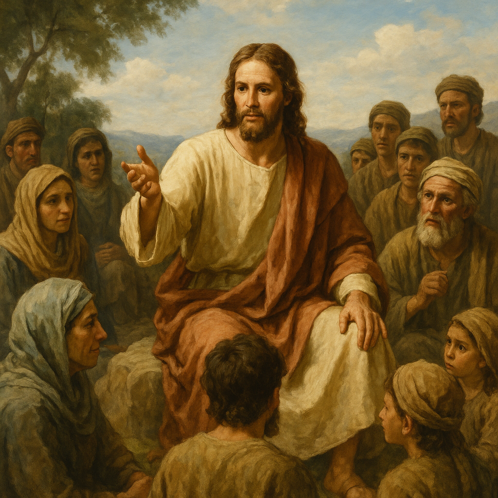

Будучи Христианином я тем не менее долгое время не мог понять от чего же спасает Христос? Почему дорога к Богу-Отцу лежит через Христа? Почему я не могу восстановить связь с Богом (отсюда слово "религия") сам? Я что за Адама должен отдуваться? Причем тут заветы?

Я не очень поддерживаю идею коллективной вины, проклятий до 7 колена - когда индивид должен страдать за поступки которые он не совершал. Поэтому идея первородного греха мне мало понятна. Но будучи пчеловодом я допускаю что предрасположенность будь то генетическая или фенотипическая или культурная может воспроизводить ошибки в поколениях и поэтому сверх-существу проще описать наследственные болезни общим термином.

Таким образом грех это просто ошибки или информационные болезни людей. Людей крайне сложно излечить всех разом, потому что люди с одной стороны глупы что-бы быстро учиться на своих ошибках и не повторять их, а с другой их время жизни очень ограничено и новые поколения начинают по-сути идти по тем же граблям.

Если проводить аналогию с программированием, то это как если бы вы пытались писать проект где у вас высокая текучка кадров и нанимают только джунов. К тому времени как вы обучаете работника, он уже "переходит в мир иной". 

Проводя аналогию с пчелами, если вы вообще не лечите пчел от клещей то за несколько поколений пчел, колония погибает.

Появление Христа это исторический феномен, повлиявший на историю человечества. 

До Христа человек и цивилизация вокруг видели смысл жизни в 
- балансе с природой через обмен и жертвы (язычество)
- в безопасности (местные боги городов)
- в понимании природы через очеловечение ее (греческие и египетские пантеоны)
- осознании и управлении собой (буддизм)

То Христос превозносит смысл пробуждения до космических высот. Мало того что ты, Человек, страдаешь из-за своих ошибок (грехов) и ты можешь от них избавиться, но ты это должен сделать это коллективно. Ты должен вылечить все человечество и Христос - первый кто показывает путь как. В Нагорной проповеди он пробуждает эту новую этику человечества.

И дальшье золотой путь, дхарма Христа, ведет его невинного на смерть. Цивилизация съедает его. Зачем? Какой смысл оказываться на кресте? В подтверждении своего учения. Любовь через поступок.

Даже если вы атеист  и не верите в божественную природу, согласитесь что это удивительно как одна смерть смогла преобразить природу человечества на тысячелетия вперед. 

Ведь если подумать, цивилизация строится именно на доверии человека к человеку. Если бы вы вдруг перенеслись в альтернативную вселенную, что останавливает людей от убийства друг друга, каннибализма, дикарства? Только программа в вашей голове. Программа которую Спаситель исправляет рекурсивным самоочищением на долгие поколения.

Христос спасает человека от его греха. Это заплатка от вируса которая говорит да, ты совершаешь ошибки головой, но в сердце ты знаешь как правильно. Не унывай, я рядом, прислушайся, не бойся, измени себя к лучшему и спасешься.

