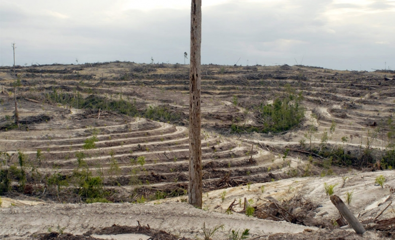

воскресенье, 20 сентября 2009 г. в 15:32:21

Посмотрел документальный фильм «_[Home](http://www.youtube.com/user/homeproject)_» о земле как единой экосистеме и вмешательстве человека. Один из тех «зелёных» фильмов, которые энергетики и промышленники так не любят.

Основная идея чётко описана и хотя кажется пессимистичной, я думаю что за **осознанием последствий глобализации** — будущее человечества. Человечество либо поймёт что оно часть природы и не в состоянии полностью её подчинить, либо погибнет как те жители острова Пасхи, которые вырубили все пальмы и остались без древесины для каноэ.

Или ещё один пример — великое вымирание 96% всего живого в палеозое (пермский период) произошло по всей видимости из-за застойности воды в океане. Большие океанические течения просто перестали гонять воду между экватором и полюсами, возник недостаток кислорода (аноксия).

<!-- truncate -->

Энергетически-пищевую историю человечества можно разбить на следующие переломные моменты

1. Охота и собирательство
2. Земледелие и животноводчество
3. Паровой двигатель, двигатель внутреннего сгорания
4. Атомная и термоядерная энергетика

А вот тропический лес Борнео в результате этих переломов. Частичная вырубка тропического леса невозможна, а полная - приводит к истощению почвы.

### Против естества

Фильм говорит о неестественном развитии человечества, которое получило энергию солнца, запасённую во времена динозавров — ведь большинство траспорта работает не на атомном электричестве, а на нефти. И в зависимости от её потребления меняется и наш быт:

|плюсы цивилизации|минусы природе|
|---|---|
|- меньше энергии требуется на обработку земли- можно лучше контролировать поливку растений, что-бы они давали больше плодов- можно выращивать растения в пустынях, используя артезианские скважины из глубоких 200 м пластов- можно возводить целые города в неестественных условиях (например Дубай, Las Vegas, Palm springs) и опреснять морскую воду- Можно целенаправленно получать каучук, пальмовое масло, эвкалиптовую древесину|- большинство зерна расходуется на скоростное выращивание скота в «концентрационных лагерях»- большинство фруктов в Европе выращиваются с теплицах чуть ли не круглогодично, получаясь неестественно большими, малоароматными, обработанными пестицидами и генетически ущербными из-за отсутсвия межвидовой конкуренции- артезианские воды истощаются и их нельзя использовать вновь- опреснение морской воды требует ещё большей затраты энергии- многие реки и моря теряют приток воды из-за искуственной сетки орошения (Колорадо, Мертвое и Аральское море)- Специализированный подход вынуждает государства становится сырьевыми придатками, добывая продукт в ущерб природе, истощая почву, вырубая|

И ладно эти проблемы решило бы государство, но государств много, а природа одна — рыба незнает что в Марокко улов рыбы в этом году ограничен, а в соседних государствах нет. 

Или вот в Канаде есть нефть, только она сосредоточена в песке, и на добычу приходится тратить много воды и энергии, после чего остаются безжизненные технические пустыни и болота.

Итого источники проблем

1. Жадность — жажда скорой прибыли, забывая о стабильности окружающей среды
2. Инерция рождаемости — некоторые города вырасли в 10 раз за последние 40 лет за счёт урбанизации и миграции
3. Глупость — вмешательство в естественные процессы, без понимания их последствий; непонимание последствий из-за плохого образования

Фильм говорит о том что нам осталось 10 лет до того как метан из болот вечной мерзлоты Сибири не растает и не нанесёт нокаут погоде. Мне кажется что _мы_ уже **опоздали**. Мы, новое поколение 70-90х годов из развитых стран, озабоченное личным будующем, только сейчас подходим к пониманию процессов природы и роли государств. Но уже поздно.

Локомотив глобальной торговли будет работать на износ — вегетарианцы будут в меньшинстве, зелёные будут отбивать пороги парламентов не в силах остановить нефтегазовые корпорации, а правительства будут заботится стабильности и благосостоянии общества, но не уважения природы. У всех в памяти остались индейцы америки, а прообраз уходящих на запад эльфов из трилогии Толкина всегда останется символом недостижимого единства силы и понимания.

И может это к лучшему? Может исчерапание 75% рыбных ресурсов, ускоренное вымирание в 1000 раз более естественных темпов, исчезновение шапки ледовитого океана — всё это научит на ошибках, научит через образование, научит уважать жизнь? А что может сделать один человек для планеты? Создать информационный вирус, который заставил бы всех изменить свои ценности в жизни.

Слишком поздно для пессимизма.

По теме: 

- [Карабаш - чёрная точка планеты](http://ekimoff.ru/191/)