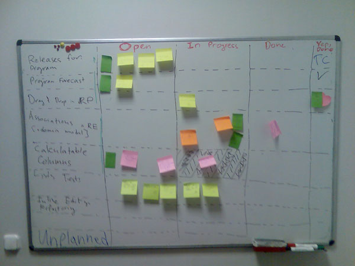
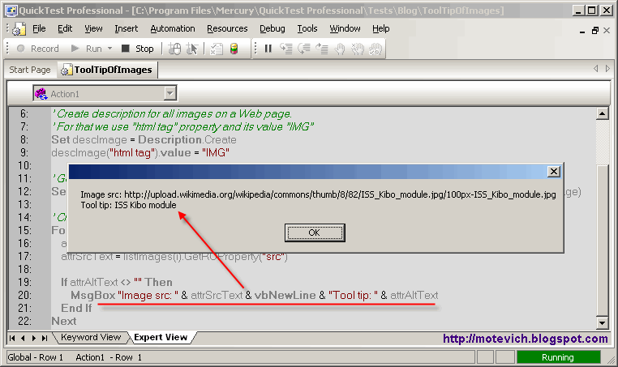
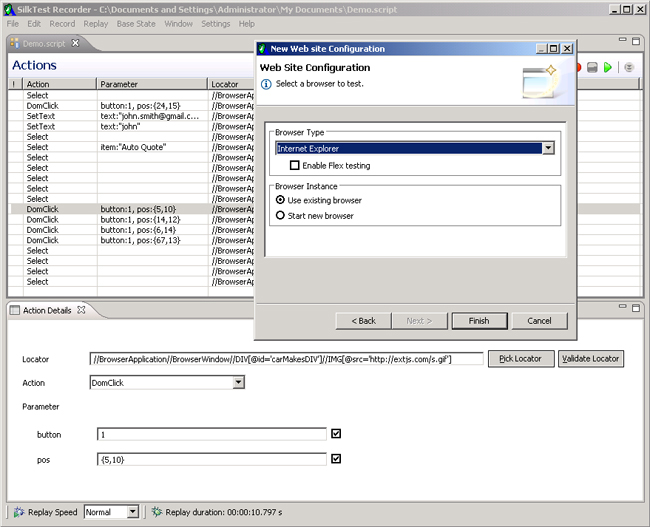
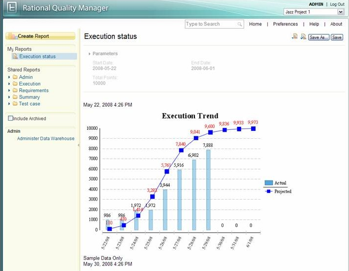

Тестирование софта это процесс, участвующий во всех жизненных циклах его разработки, который занимается проверкой и планированием требований продукта, подготовкой и проведением изменений в разрабатываемой системе. Как следствие — находятся несоответсвия требованиям и ошибки, оцениваются инструменты которые были использованы.

А если отвлечься и рассматривать системно, то роль тестера на самом деле лежит в каждом человеке. Если смотреть на проект как на человека, то роли

- управляющего проектом это позвоночник и вегетативная нервная система
- программисты это скелет и моторика
- аналитики это органы чувств
- тестеры это совесть

<!-- truncate -->

Quality Assurance часто считается синонимом тестирования, но на самом деле это методика предотвращения ошибок, а не их поиска и исправления. Качество в этом смысле - характеристика сделанного продукта.

Формально говоря, тестер должен проверять даже т_ехническое задание, план проекта и анализ_ на логичность и понятность, а не только код и интерфейс программы. Тестирование как независимая дисциплина в общем потоке разработки ПО появилась в начале девяностых, когда стали более важны аудитория (клиенты), качество и время разработки.

Важность тестирования ПО особенно важна в критических системах. К примеру аппарат по лучевой терапии [Therac](http://ru.wikipedia.org/wiki/Therac-25) (1985) облучил смертельной дозой радиации 6 человек из-за отсутсвия проверки состояния агрегата в коде и валидации. Или марсоход в 1999 году принёс убыток в 125 млн долларов из-за непродуманности единой системы измерения между коммандами разработчиков. И даже в Эстонии при электронных выборах были проблемы из-за плохого_нагрузочного тестирования_.

Основные принципы тестирования воплощены в небольшом документе [ISTQB](http://www.istqb.org/) и в книге «Foundations of software testing». Вся «прелесть» специальности тестера в том что как правило для этого не нужны большие познания в программировании и люди далёкие от web-строительства могут себя попробовать в этой роли, впрочем в смежных с IT системах без хорошооплачиваемого тестирования не обойтись (автомобилестроение, военные технологии). Тестированию посвящены даже некоторые журналы, например [TEST Magazine](http://www.testmagazine.co.uk/).  

---

### 7 принципов тестирования

1. Тестирование показывает наличие дефектов, но не доказывает их полное отсутсвие
2. Полное (exhaustive) тестирование невозможно. Перебрать все комбинации ко входам можно только в тривиальніх случаях. Надо фокусироваться на приоритетах
3. Начинать тестирование надо на как можно ранних этапах цикла разработки
4. Ошибки физически образуют кластеры (наиболее ошибочны конкретные модули)
5. Парадокс пестицидов - ошибки подстраиваются под существующие тесты, поэтому их надо периодически обновлять
6. Тестирование зависит от контекста системы
7. Отсутствие дефектов не значит выполнение требований и ожиданий пользователя  
    

### Организационный процесс

Тестирование как часть работы компании над проектом может проходить либо в waterfall-подходе, где под тестер подтягивается лишь под конец проекта, либо по agile-методологии, где с каждой итерацией выкатывается готовая версия.

Итерация тестирования состоит из следующих пунктов

1. Планирования. Определяются цели, инструменты, время, порядок. Самая психологически сложная часть - понять и запомнить как система _должна_работать, особенно когда нет технического задания, документации и вменяемого управляющего проектом (см. _exploratory testing_ ниже)  
      
    Посему у тестера хотя-бы внутренний, но анализ состоит из..
    - Условий (conditions)
    - Истории взаимодействий (cases
    - Воплощение в виде документа (basis) со ссылками на спецификацию, архитектуру и прочие документы (коли они есть)
2. Проверки. В случае недоступностей и непонятностей - когда и с кем связаться что-бы задание не забылось.
    - Приоритезация тест-case'ов (обычно 1 case = 1 требование = 1 web-страница). Какие сценарии самые критичные? Какие в разработке и наиболее рискованные?
    - Группировка тестов в комплекты (suite) по общим модулям
    - Проверка и сравнение с требованиями (собственно поиск ошибок)
    - Написание рапорта (как багов, так и общей картины - процент покрытия)
    - Перепроверка изменённой части (confirmation, retesting) или влияния на неизменённые части (_regression testing_)
3. Завершение. Архивация тестов, сохранение полученных уроков.

### Тестирование спецификации

Мне как программисту приходится, к несчастью, постоянно сталкиваться с неправильно сформулированными заданиями. Аналитикам составляют стоит обратить внимание на следующие пункты

1. Многозначность - общая и самая главная проблема. Задание недостаточно чётко описано.  
    
2. Неопределённые термины (очень, много, часто..)
3. Обобщение (все, всегда). Как часто бывает в программировании - злоупотребление глобальными переменными вредно, ограничивает и вводит конфликты в спецификации  
    
4. Специфичные термины без ссылки на их описание
5. Уровень обобщённости (все,многие,некоторые) - глагол говорит обо всех или об одном?
6. Критические слова (только, тоже, особенно) сильно ограничивают глобальные права и часто с ними противоречат (например - _анонимные пользователи могут только читать на форуме_)
7. Диапазоны/отрезки без указания включительны ли окончания или нет ( например "от 5 до 10")  
    
8. Местоимения/замены (он, это, его, она) вызывающие двусмысленность ( например "оповещение события должно показываться только когда оно обязательно")
9. Многозначность порядка союзов И/ИЛИ в предложении. Не все математики и не у всех приоритет И выше чем ИЛИ, поэтому проще писать односложными предложениями.  
    
10. Тип vs Экземпляр (конкретный instance или класс в общем?)
11. IF без ELSE. Как правило вызывает внутренние недостатки в показе ошибок и тп.  
    
12. Сравнение трёх или более человек
13. Незаконченные списки (и тд., тп., и др.), например при перечислении показываемых данных. Частая финансовая дыра для заказа дополнительных работ.  
    

Поля ввода данных в формах должна тоже в документации отражаться, но часто она недостаточна для программистов. Примитивная проверка в зависимости от типа может проверять..  

1. int - min, max, 0, float, точка или запятая, точность
2. date - format, будущее, прошлое, связь с другой датой для промежутков

### Уровни тестов

У тестов есть свои уровни, иерархия и классы (привет игроки RPG!). Проверять можно как разные части приложения (тоесть по площади, по страницам), так и разные свойства этого участка (тоесть в глубину, степени качества). Вот по размерам площадок можно тесты разбить на категории..

- Модульные (_unit-testing_). Полуавтоматическое тестирование, в том плане что тесты приходится писать программисту в очень тесном контакте с кодом классов которые unit-тест должен проверить. Не обязательно следовать TDD, можно написать хотя-бы для самых критичных частей (финансовые операции и тп.)
- Интеграционные (_integration testing_) проверяют связи между разными модулями. Можно делать как до общей интеграции системы (модуль за модулем), так и после (пишем, пишем, сложим - протестим до финального _acceptance_-теста). Тут опять тесная работа с кодом и программистами.
- Системные - пройтись по всей системе и найти несоответсвие общим стандартам и спецификации в целом. Как правило под конец, когда система в основном готова.
- _Acceptance_-тест проходит как правило уже с клиентом при передаче проекта и показывает готовность работы с клиентами. Именно на этой стадии появляются _альфа_ версии (всё лежит ещё вероятно у разработчика на машине, привлекаются сторонние тестеры) и бета версии (всё уже лежит у клиента, привлекаются потенциальные клиенты)

### Типы тестов

Теперь собственно по сути тестирования..

- Функциональные отвечают на вопрос «**что**» должно делать приложение
- Нефункциональные требования/тесты отвечают на вопрос «**как**». Нефункциональные включают в себя свойства удобства интерфейса, надёжности, безопасности данных, масштабируемости, кроссплатформенности и даже экономической целесообразности (см. ISO/IEC 9126)
- Внешние (black box) / Внутренние (структурные, white box). Структурное тестирование проверяет внутреннюю структуру приложения как оно реализовано, но нуждается в понимании кода. Техники чёрного ящика исходит из того что ПО ещё не реализовано либо мы не знаем его точной работы, зато есть спецификация как должно всё работать. Структурные (_white box_) техники тестируют приложение снизу вверх, концентрируясь на максимальном покрытии кода (а не комбинаций входа-выхода в интерфейсе). Обычно white box техники используются в дополнение к чёрному ящику (как должно работать).
- Регрессионное тестирование - а не поломалось ли что-то из-за этого изменения? Как правило именно это надо связывать с unit-тестированием для большей [автоматизации](http://eagleson.livejournal.com/243485.html)
- Тест-поддержка (_maintenance testing_) - система уже работает и мы просто её обновляем (deploy & migration). Миграции в последнее время тоже как правило автоматизируются.
- Динамическое / статическое тестирование. Динамическое подразуемевает интерактив, работу с готовой системой или кодом. Это не всегда обязательно и возможно. Теоретически можно тестировать документацию или проверять логичность анализа, находить ошибки из логов и тп.

Тестеры как и «писатели тех-задания» для самоконтроля всегда должны помнить аббревиатуру SMART, что-бы их правильно поняли более практичные люди.

- Specific - **точное** описание требования, без копи-пастов переписки с клиентом, чатом, дампом данных и односложными предложениями
- Measureable - **измеряемое** значение чисел, времени, вероятности, пользователей, местоположения.
- Attainable - **технически-достижимые** требования. Не всё ещё возможно технически, вперёд прогресса не угонишься
- Realizeable - **человечески-достижимые** людские требования по времени, качеству, знанию, цене
- Traceable - **соответсвие** изначальной идее и цели, логичность соответсвия нескольких требований.

### Black box техники

**Ad-hoc** (monkey) - случайное тестирование без определённой стратегии

**Исследовательское тестировани**е (exploratory testing) - изучение продукта если документация во многом отсутствует

Группировка ошибок по **эквивалентным классам** (_equivalence partitioning_). Самая популярная методика. Берутся все входы и проверяются требования (по длине символов, возможных значениях). В тестах для минизации их количества классы разных входов комбинируются что-бы сделать максимальное покрытие ошибок.

Ещё одна техника существует преимущественно для целочисленных значений. Ошибки как правило возникают в **пограничных значениях**, поэтому методика так и называется (_boundary value analysis_). Выбираются два или три значения возле границы. Например если максимальная длина заголовка 250 символов, то как будет выдаваться ошибка при 249, 250 и 251 значении?

Более приближенная к динамическим системам есть методика проверки **перехода состояний** (_state transition testing_). Состояние зависит от входа и от предыдущего состояния. Состояния и переходы описываются графами (_finite state machine_).

**Таблица решений** (decision table testing) сама собой приходит в голову когда бизнес-правила в приложении очень сложные и нуждаются в больших математических вычислениях. С помощью таблиц можно минимизировать число уникальных комбинаций

**Тестирование сценариев** (use-case based) проходит согласно созданных в анализе сценариях, с учётом разных ролей, альтернативных потоков.

**Интуитивно-опытное тестирование** (experience-based) как уже понятно приходит у человека со временем и позволяет находить систематические ошибки дизайна, программистов, потока данных с учётом изменения кода.

### White box (структурные) техники

Цель структурных техник - максимально покрыть тестами код (_code coverage_), а поскольку white box используется как дополнение к сценарным техникам, то логично, что есть и максимальное покрытие сценариев или, точнее, их разветвлений (statement & decision coverage).

Математически процент покрытия = 100% * число **покрытых единиц** / число всех единиц. Это не значит, что будет всё протестировано, только выбранные единицы тестирования (_coverage item_). Единицы тестирования для каждой роли по разному выглядят - для разработчиков это таблицы БД, функции в коде, запрос к внешнему компоненту, тогда как для тестера и аналитика это действия в сценарии, классы эквивалентности.

Поднимаясь выше над единицами тестирования можно увидеть **предложения** и соответственно покрывать их (_statement coverage_). Хорошее тестирование с методиками чёрного ящика могут покрыть до 60-75% предложений. В плане кода это конкретная строка

Покрытие **разветвлений** (_decision coverage_) уже более высокий уровень, включает все типы иерархии (if-else, switch, вызовы методов и тп.). Методами чёрного ящика можно покрыть 40-60%. **Циклическая сложность** (cyclomatic complexity) - проверка алгоритма известная всем информатикам на квадратичную, экспоненциальную и логарифмическую сложность.

Следующая степень покрытия включает возможные **пути** по которым в принципе можно пройти по равзветвлениям. Теоретически этих путей бесконечно много если учитывать все циклы.

### Составляющие бага

Самая большая проблема как я уже наверху писал - неточное описание бага. Программисты тратят много времени на то что-бы понять где и что происходит неправильно и как оно должно работать. Правильный баг-report включает в себя:

- _Уникальный ID_ по которому можно на него ссылаться
- _Ссылка на требование_ которое не выполнено (ID или пункт в .doc файле)
- Цель требования вкратце
- Предшествующие обстоятельства (местоположение, пользователь, группа)
- Вход (действия пользователя)
- Выход (существующая реакция системы)
- Ожидаемый выход (согласно требованию)
- Дополнительные требования (бонус?)
- Дополнительные связи

### Инструменты

Наиболее знакомые инструменты программистом это конечно системы отслеживания ошибок (bug/issue tracking) - [Mantis](http://www.mantisbt.org/), [Bugzilla](http://www.bugzilla.org/), [Jira](http://www.atlassian.com/software/jira/) и [Trac](http://trac.edgewall.org/). Некоторые IDE могут интегрироваться с ними так, что commit-действии в репозиторий версионной системы (SVN/CVS/Git/Mercurial) можно обновить баг без работы в браузере.

Есть и более общие, индустриальные продукты включающие в себя и составление требований, группировку сценариев - [HP (Mercury) Quality Center](https://h10078.www1.hp.com/cda/hpms/display/main/hpms_content.jsp?zn=bto&cp=1-11-127-24_4000_100__) и [IBM Rational Quality Manager](http://www-01.ibm.com/software/awdtools/rqm/standard/) Автоматизированное тестирование интерфейсов сейчас наиболее популярно с помощью [Selenium](http://seleniumhq.org/), [SilkTest](http://www.borland.com/us/products/silk/silktest/index.html), [HP QuickTest Pro](https://h10078.www1.hp.com/cda/hpms/display/main/hpms_content.jsp?zn=bto&cp=1-11-127-24%5E1352_4000_100__), QF-Test, [Rational Robot](http://www-01.ibm.com/software/awdtools/tester/robot/index.html), [TestComplete](http://www.automatedqa.com/products/testcomplete/), [Watir](http://watir.com/), TestPartner, [CubicTest](http://cubictest.seleniumhq.org/), [Windmill](http://www.getwindmill.com/). Есть и более экзотические тесты типа [soapUI](http://www.soapui.org/)

Нагрузочное тестирование чуть более сложное, потому что нужны дополнительные машины (скажем одна машина симулирует 300 пользователей-соединений) - на одной машине запускать 3000 соединений как правило невозможно. Инструменты:

- Мелкие - Apache ab, [httpperf](http://httperf.comlore.com/), [openload](http://freshmeat.net/projects/openload/), [Neoload](http://www.neotys.com/evaluation/overviewEval.html), [hammerora](http://hammerora.sourceforge.net/), [dklab multiplexor](http://dklab.ru/lib/dklab_multiplexor/)
- Большие - Apache [JMeter](http://jakarta.apache.org/jmeter/), [IBM Rational Performance Tester](http://www-01.ibm.com/software/awdtools/tester/performance/index.html), [HP LoadRunner](https://h10078.www1.hp.com/cda/hpms/display/main/hpms_content.jsp?zn=bto&cp=1-11-15-17%5E8_4000_100__) (Mercury), [Oracle Application Quality Management](http://www.oracle.com/enterprise_manager/application-quality-solutions.html) (Empirix e-Load)

