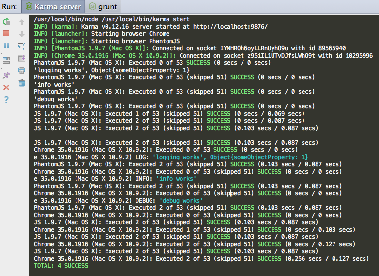

Я когда-то писал про тестирование [javascriptа с помощью jstestdriver](http://kurapov.name/rus/lab/quality_control/requirejs_jstestdriver/) , поскольку тот был первым интегрированным в PHPStorm, но инструменты развиваются и теперь для ангуляра есть простор для проверки качества кода.

[Karma](http://karma-runner.github.io/) это консольный инструмент для запуска тестов согласно конфиг файлу. Тесты гоняются в разных браузерах, умеет следить за изменениями исходников и генерировать покрытие кода. Есть ещё [protractor](https://github.com/angular/protractor) - близкий по смыслу но для системных тестов.  

[Jasmine](http://jasmine.github.io/2.0/introduction.html) это уже библиотека для тестирования, аналог Mocha.

<!-- truncate -->

Для установки всего набора:

```bash
npm install karma -g
npm install phantomjs -g
npm install karma-jasmine karma-chrome-launcher karma-phantomjs-launcher istanbul --save
bower install angular-mocks
```

 

Теперь надо добавить karma.conf.js где надо указать пути к файлам которые будут подключаться и пути к тестам. Для этого проще всего запустить **karma init** - он создаст шаблон

После того как тесты написаны - надо запустить **karma start**. При прогоне тестов с установленным istanbul, в папку coverage будет генерироваться html с детальным покрытием. Для ангуляра нужна [angular-mocks](https://github.com/angular/bower-angular-mocks)

### Jasmine

Jasmine пожалуй самый популярный сейчас фреймворк для js-тестов. Структура файлов довольно простая и в нём ключевые слова:

- describe() - оборачивает тесты в test-suite  
    
- beforeEach() и afterEach() - соответсвенно запускаются для каждого теста  
    
- it('название теста', function(){}) - сам тест
- iit() и xit() - выделяют тест что-бы прогнать только его или игнорировать его соответственно

### Promise-объекты

Сложность при работе с js в том что код асинхронный, а значит тесты не могут ждать неизвестно сколько времени, покуда исполнится скрипт. Поэтому паттерн _задержанных обьектов-обещаний_ ([deferred в jquery](http://api.jquery.com/category/deferred-object/) и [promise в angular](https://docs.angularjs.org/api/ng/service/$q) соответсвенно), полезны в тестировании тем что их можно преждевременно заменять в моках и сразу же _resolve'ить_ на нужные результаты.

Наиболее частый случай таких замен - ajax запросы. В angular имеется $http сервис и для него уже существует [$httpBackend](https://docs.angularjs.org/api/ngMock/service/$httpBackend) мок, которым легко эмулировать весь обмен данными с backend. Есть ещё [$timeout и $exceptionHandlerProvider](https://docs.angularjs.org/api/ngMock) для особенных случаев

### Пример теста

Набор юнит-тестов сервиса у меня в общем выглядит так

```
describe('In memory cache service', function () {
    var objectToTest;
    var $httpBackend;

    beforeEach(function () {
        module('app');

        inject(function ($injector) {
            objectToTest = $injector.get('MemoryService');

            $httpBackend = $injector.get('$httpBackend');
            $rootScope = $injector.get('$rootScope');
        });
    });

    afterEach(function () {
        $httpBackend.flush();
        $httpBackend.verifyNoOutstandingExpectation();
        $httpBackend.verifyNoOutstandingRequest();
    });

    it('should have a MemoryService', function () {
        expect(app.MemoryService).toBeDefined();
    });

    it('setter and getter check', function () {
        var v = {a: 1};
        objectToTest.setCache(v);
        expect(objectToTest.getCache()).toEqual(v);
        objectToTest.emptyCache();
        expect(objectToTest.getCache()).toEqual({});
    });
    
    it('should recieve data', function(){
        var exampleData = {
            1:{'username':'JamesBond'}
        };
        
        $httpBackend.expectGET('api/users').respond(exampleData);
        objectToTest.loadOverNetwork().then(function(){
            expect(objectToTest.getCache()).toEqual(exampleData);
        });
    });
    
    
    it('should not clear cache on error', function(){
        var exampleData = {
            1:{'username':'JamesBond'}
        };
        objectToTest.setCache(exampleData)
        $httpBackend.expectGET('api/users').respond(404, false);
        
        objectToTest.loadOverNetwork().then(function(){}, function(){
            expect(objectToTest.getCache()).toEqual(exampleData);
        });
    });
});
```

Я ещё не успел проапгрейдится до PHPStorm 7, где [есть тесная интеграция с кармой](http://blog.jetbrains.com/webstorm/2013/10/running-javascript-tests-with-karma-in-webstorm-7/), поэтому у меня тесты выводятся в консольке..


### Ссылки  

По теме, с увеличивающейся сложностью:  

- [Официальные доки angularjs](https://docs.angularjs.org/guide/unit-testing) - не очень информативны, но отрезвляют что надо всё изолировать 
- [Advanced Testing and Debugging in AngularJS](http://www.yearofmoo.com/2013/09/advanced-testing-and-debugging-in-angularjs.html) - общее введение когда как тестить 
- [Тестирование AngularJS сервиса с помощью Jasmine и Karma](http://www.simplecoding.org/personal-maps-testirovanie-angularjs-servisa-s-pomoshhyu-jasmine-i-karma-chast-5.html) - очень подробно разжёвано что и как с сервисами
- [Unit Testing Best Practices in AngularJS](http://andyshora.com/unit-testing-best-practices-angularjs.html) - достаточно примеров  
    
- [Mocking $resource and promises in AngularJS unit tests](http://projectpoppycock.com/mocking-resource-and-promises-in-angularjs-unit-tests/)  
    
- [Injecting a mock into an AngularJS service](http://stackoverflow.com/questions/14773269/injecting-a-mock-into-an-angularjs-service)

