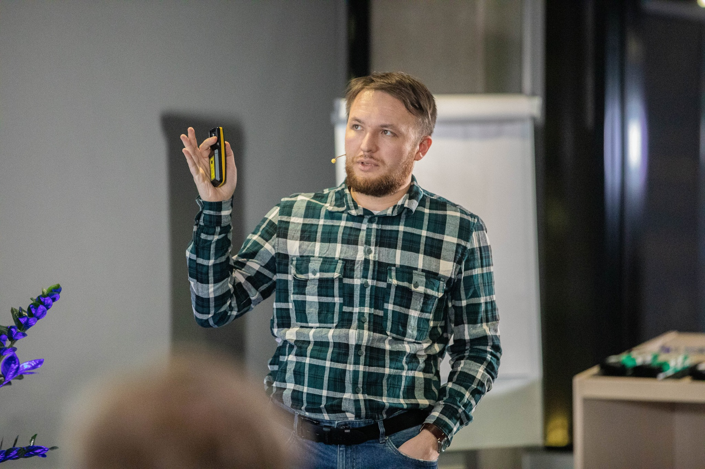
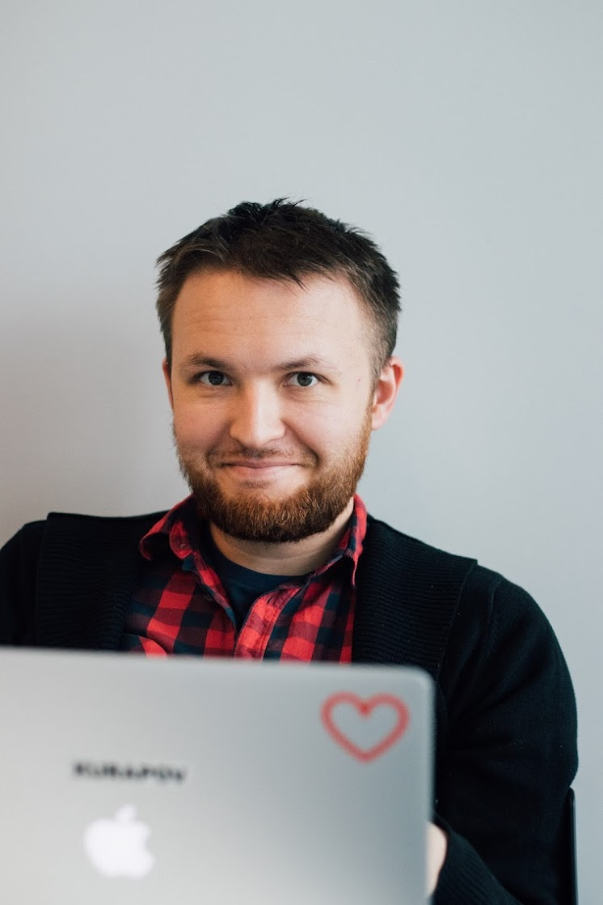
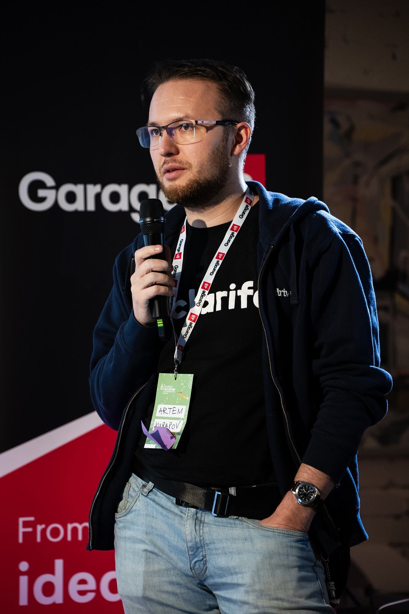

My name is Artjom Kurapov. I am a father, software engineer, cat keeper, and beekeeper.
- I build many side projects.
- I keep personal notes in a second-brain style.
- I publish some of those notes here in my blog.
- I make AI music when I am in the mood.
- I attend local meetups related to software and startups.
  - [devclub](http://devclub.eu/), TallinnJS, Garage48, Lift99, Palo-Alto, Technopol
- I enjoy hackathons where you need to build something within strict time limits.
- I am looking for new ideas and projects, including opportunities to help others.

## Interests and Growth Areas
These are topics I do not yet know well, but intentionally want to develop in:
- robotics (motor control and vision)
- science (astrophysics, microbiology, entomology)
- video games (creation, engines, game design, lore, animation)
- EDC (safety and survival)
- drawing (anatomy, light and shadow, isometry)

|  |  |  |
| ------------------------------------------------------------- | ------------------------------------------------------------- | ------------------------------------------------------------ |
|  |                                          |  |

## Education

- [Tallinn University of Technology](http://ttu.ee/),
  Informatics, MSc (2007-2011)
- [Tallinn University of Technology](http://ttu.ee/),
  Computer and Systems Engineering, BSc (2002-2007)
- [Tallinn Secondary School No. 6](http://www.kvg.tln.edu.ee/) (Central Russian Gymnasium) (1993-2002)
- [Kharkiv Secondary School No. 4](http://lyceum4.edu.kh.ua/) (Pedagogical Lyceum) (1992-1995)

## Profession

I started in small studios delivering short projects for clients such as [Elisa](http://www.elisa.ee/), [SEB](http://www.seb.ee/), [Sampo Pank](http://www.sampopank.ee/), [Postimees](http://postimees.ee/), [GlaxoSmithKline](http://gsk.ee/), [Reformierakond](http://www.reform.ee/), [IRL](http://www.irl.ee/), [Eesti Raadio](http://www.err.ee/), [RMK](http://rmk.ee/), and [Rovio](http://rovio.com/).

After that, I moved to longer product efforts like [Navigil](https://www.navigil.com/) and [GolfGameBook](https://golfgamebook.com/). Later I joined startup companies building one core product over many years: [Tactic](https://tacticrealtime.com/), [Pipedrive](https://www.pipedrive.com/), and [Clarifai](https://clarifai.com/). This allowed me to go deeper into product design and full-stack quality, and to grow as a T-shaped full-stack engineer.

I like studying and designing complex systems and information flows across time and user contexts under platform constraints. That is why I focus on **integration** and testing. I have hands-on experience with CMS, CRM, ECM, e-commerce systems, social network APIs, and mobile apps.

#### Technical Stack Experience

| Area                   | Stack |
| ---------------------- | ----- |
| Languages              | Typescript, Go, Python, PHP |
| Databases              | Postgres, MySQL, MongoDB |
| Backend frameworks     | Gqlgen Fastify, Koa, Express Zend Framework, Code Igniter, Yii, Kohana, Symfony |
| Development and support| PHPUnit & SeleniumRC/Grid, SVN, Git, Jenkins, Webgrind, XDebug, XHProf, Bower, Karma, Grunt, Jasmine |
| APIs                   | Social (Facebook, Twitter, Google, Linkedin) Accounting (Hansaworld, Economics) Payments (DIBS, Cybersource, Fortumo) Specialized (Micros MyFidelio, Xtee, Mobiil-ID & Digidoc) |
| Trackers               | Trello, Pivotaltracker, Mantis, Jira |
| Frontend frameworks    | React, Angular 1, Backbone |
