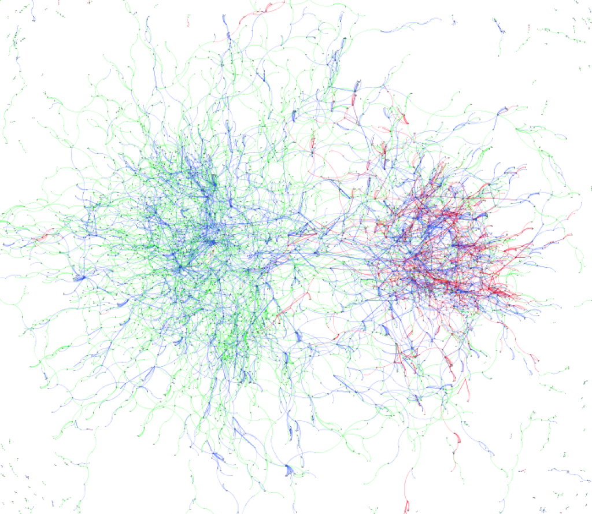

I decided to dedicate my master thesis to graphs. First, because I felt I had heard too little about them at TalTech, and second, because my [bachelor thesis](Bachelors%20Thesis.md) was related to web indexing.

At first I wanted to map the Estonian `.ee` domain segment, but then switched focus to social networks and their patterns. That was also influenced by my work at the time on a local social network for young users.

During that period, major media events were unfolding in another social network, Twitter: the Arab Spring, elections, and Skype outages in Estonia. Due to the breadth of the chosen topic, I could not study those events in detail.

In the practical part, I used [Gephi](https://gephi.org/) and wrote my own graph rendering library. I think the initial code was at https://github.com/tot-ra/grapheon, but I cannot find the final version now. Today I would probably use [d3](https://observablehq.com/collection/@d3/d3-force), although I am not sure it could handle that scale.

You can also help with the [collaborative English translation of the thesis](https://docs.google.com/document/d/18JqjHNSY52hx2lx3wN8is5OQbeiiMLNqGXqNv1LzrvE/edit?hl=ru&authkey=CMKM94EF).

An interesting outcome for me was visualization of the pling.ee social network with language segregation (Russian and Estonian), reflecting preference patterns.

- [**Visualization of evolutionary message cascades in social networks using force-directed graphs**](pdfs/Msc%20work.pdf) (PDF)
- [PDF slides](pdfs/presentation-111102103001-phpapp02.pdf)

Related works:
- [Networks, Crowds, and Markets](../img/Networks,%20Crowds,%20and%20Markets.pdf)

<iframe width="100%" height="400" src="https://www.youtube.com/embed/OMg0e0k9X9A" title="Охотники за привидениями (и я магистр)" frameborder="0" allow="accelerometer; autoplay; clipboard-write; encrypted-media; gyroscope; picture-in-picture; web-share" referrerpolicy="strict-origin-when-cross-origin" allowfullscreen></iframe>
