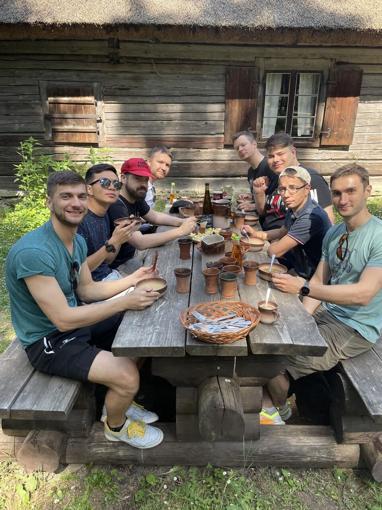

(2023-)

[Clarifai](https://www.clarifai.com/) - Global market, software as a service, full-stack AI platform, startup

## Senior Software Engineer

- Worked on auto-annotation features
- Improved video handling: YouTube import, higher limits, async processing, playback
- Supported datasets, labeling/review tasks, and workflows
- Improved DX and CI: reduced PR check time by 50%
- Improved testing quality
- Participated in interviewing and on-call rotations

<iframe width="100%" height="400" src="https://www.youtube.com/embed/CD25FaeqVRc" title="Auto Annotate Your Entire Data with a Single Click: Auto Annotation Explained!" frameborder="0" allow="accelerometer; autoplay; clipboard-write; encrypted-media; gyroscope; picture-in-picture; web-share" referrerpolicy="strict-origin-when-cross-origin" allowfullscreen></iframe>

