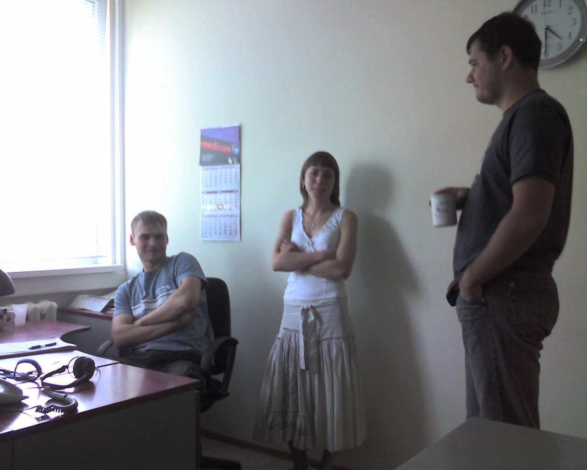

(2007 - 2008)

[Elitec.ee](http://elitec.ee/)

- Developed short-term projects with custom CMS (LAMP stack)
- Built a custom calendar module with a Google Calendar-like draggable UI
- Supported Estonian RMK.ee document management (Postgres)

Estonian market, small web-development company somewhat connected to Medicum

Gained experience with:
- SVN, Oracle
- PHP Zend Framework, Prototype.js

## Projects

| Name | Description |
| --- | --- |
| [RMK](http://www.rmk.ee/) | Internal document system for the Estonian State Forest Management Center. Like EIQA, the project started in ADM Interactive, but when additional work grew beyond reasonable support scope, development moved to third parties. PostgreSQL, custom templates, lots of legacy code, gigabyte-sized databases, CVS branching. |
| [NSA.ee](http://www.nsa.ee/) | Informational site for the Ministry of Defense. Migrated the site from an existing engine to Joomla. Completed in about 10 hours: copied design, updated menu/content, and adapted to CMS specifics. |
| [Silmalaser.ee](http://silmalaser.ee/) | Medical company providing vision correction surgery. Worked on an Oracle registration module integrated with MIS (Medicum information system). Built a PEAR-like business-logic layer (Model in MVC), tried xajax for forms. |
| Calendar | Ajax calendar module similar to Google Calendar and Kiko. Used Scriptaculous for drag-and-drop events. Included email invitations, iCal compatibility with MS Outlook, and free/busy views. |
| [Medicum](http://www.medicum.ee/) registration | Very large Oracle 9 database with clients, schedules, and doctors. Rebuilt an outdated registration system. Two independent companies estimated the effort at over 800k EEK. |
| Registration system | Conceptually similar to the Medicum registration system, but based on MySQL and using a single working-time range instead of pre-generated free slots. |

