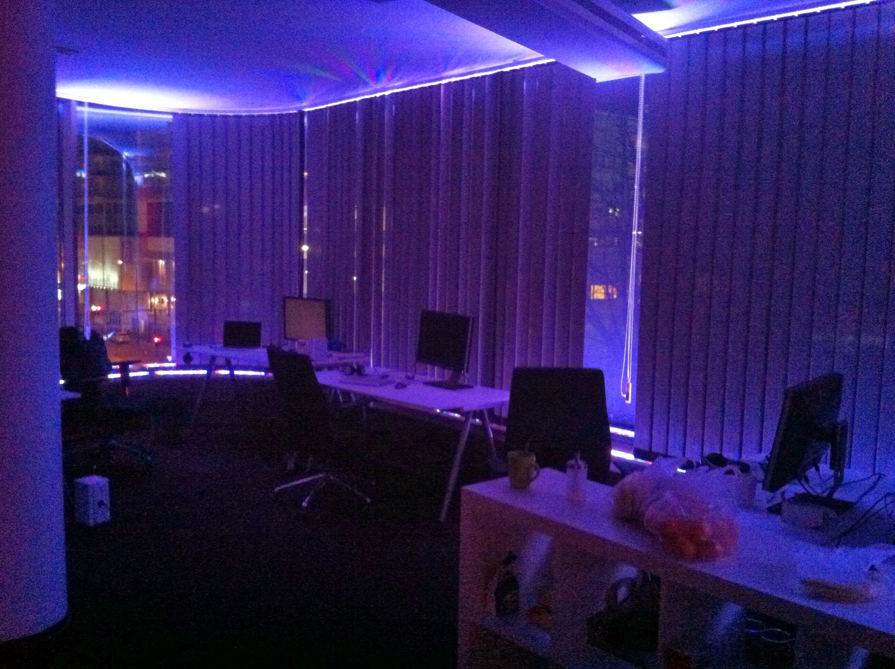
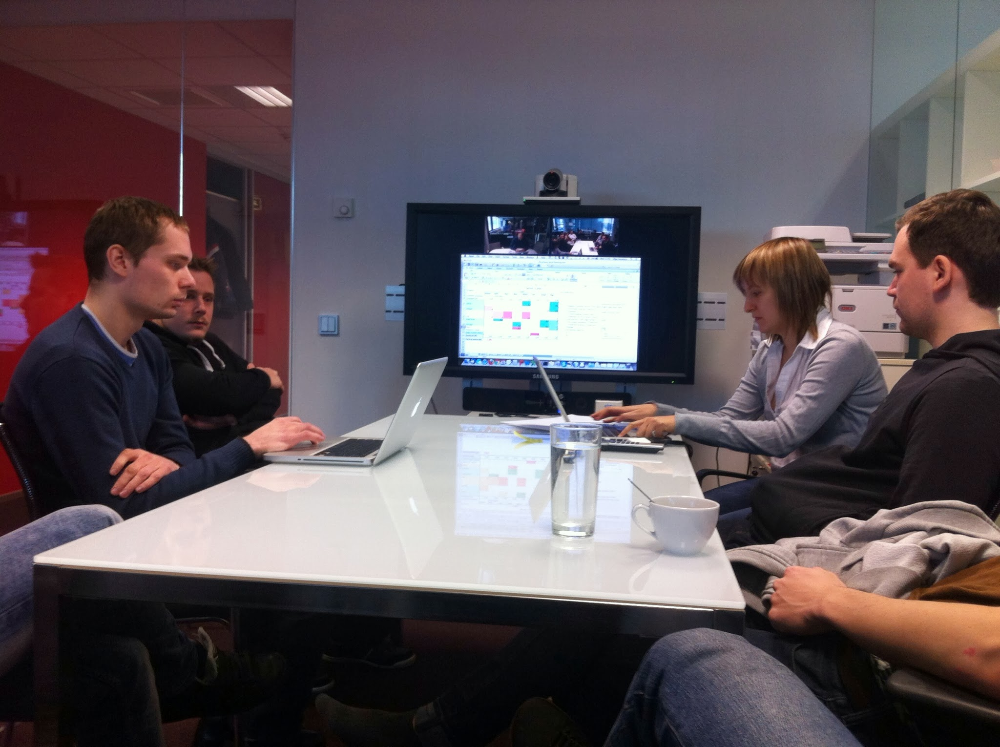

(2011 - 2014)

## Projects

| Name | Description |
| --- | --- |
| Navigil | Hardware tracking company for vehicles and people. Very long greenfield project (>1 year). I implemented around 90% of the web application and coordinated with other contributors. The app was covered by unit, integration, and acceptance tests. Stack included Jenkins, Git, CodeIgniter, Backbone, plus PHP daemons and binary processing. |
| Postimees | Local newspaper. Built an iPad article-reading experience in JavaScript with horizontal pagination, handling line wraps, inline images, and screen rotation. |
| [Planago](http://planago.com/) | Family budgeting app with advanced charts. Full frontend refactor using Backbone, RequireJS, Less. Performance optimization for iPad and IE8+, responsive design. |
| [Nenäpäivä](http://www.nenapaiva.fi/) | Charity campaign website; performed load testing with Siege. |
| [Finnvera](http://finnvera.com/) | Finnish investment fund website, similar to EAS in Estonia. Small fixes and CSV parsing. |
| [Nextdays](http://nextdays.com/) | Collaborative event planning startup. Backbone, MongoDB, Kohana, unit tests, Amazon EC2. |
| Profolio | Internal project. Maintenance and development of iPad client and MySQL/CodeIgniter backend. |
| [GolfGameBook](http://golfgamebook.com/club/) | Golf statistics platform with multiple clients and complex scoring rules. Wrote integration tests, set up Jenkins automation, documented architecture, and added Facebook integration and other internal improvements. |
| Pv | Drupal site with minor styling customizations for Views module. |
| Mailer | Added CSV contact import with Unicode support into a LAMP mailing application. |

