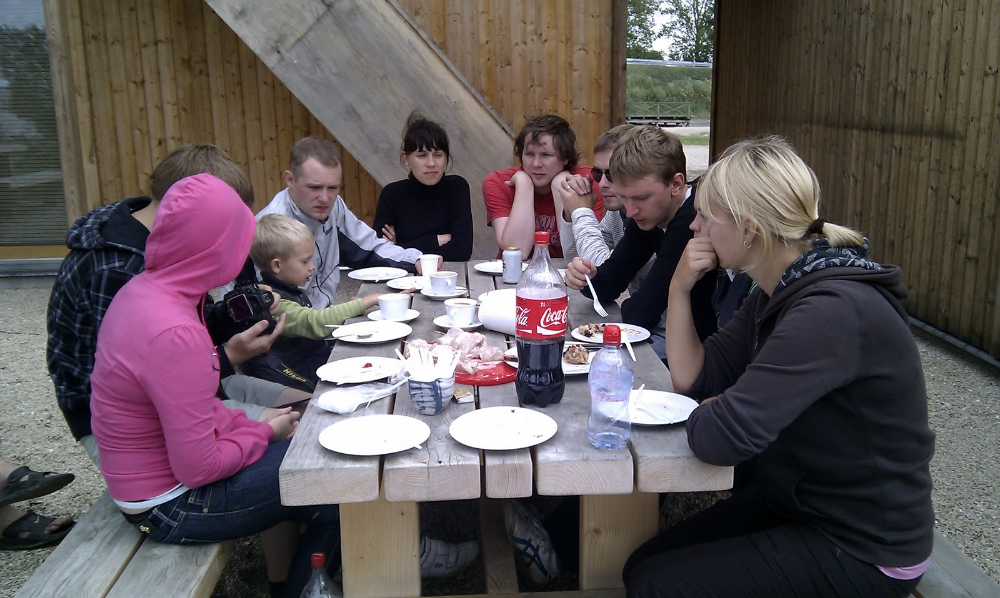
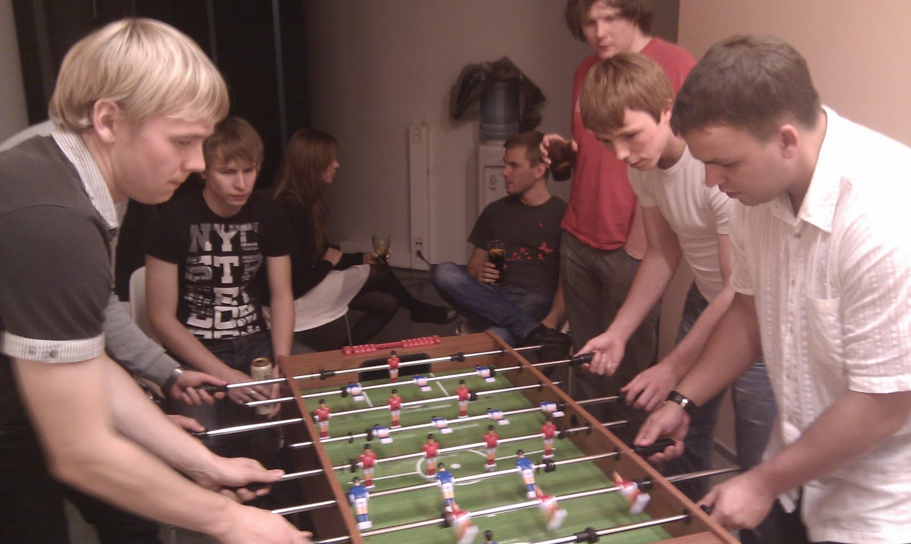

(2008 - 2011)

- Developed medium-term projects such as:
  - Rovio.com: public website for the Angry Birds company
  - Elisa.ee: mobile services, online shop and CMS, product comparison, roaming
  - Pling.ee: mobile social network, SMS gateway, user feed, friends/groups, Android app
  - Laenuvaidlus.ee: loan-law violation analysis, business rules, PDF export, digital signatures

Company background: Estonian and US market, web-development company that grew out of Exact.

Gained experience with MongoDB, Yii framework, Pivotal Tracker, Android development (Java + Eclipse), PHPStorm, and basic Ubuntu/Bash usage.

Introduced unit testing with PHPUnit, Selenium Grid automated tests across multiple OSes, and Jenkins CI.

## Projects

| Name | Description |
| --- | --- |
| [Rovio.com](http://rovio.com/) | Website for the Finnish company behind the most famous mobile game; site integration, XML data import, careers module. |
| Edream | Centralized hotel registration service, including mycityhotel.ee. |
| [Uncram.com](http://kurapov.name/content/://uncream.com) | **Startup** social network with deep browser integration, MongoDB, Amazon/RightScale scaling. Implemented auth via Facebook, Twitter, Google, and contact-list imports. |
| [Pling.ee](http://pling.ee/) | Youth social network similar to Twitter/Facebook with free communication via SMS/MMS and phone-based location. Complex aggregation/filtering, Selenium automation, social-network sync, XML API, Android app. |
| [Elisa.ee](http://elisa.ee/) | International telecom provider (mobile, internet, TV). Worked on main-site design integration, refactoring core modules, roaming module (XML import + table rendering), domains module, and major shop-module changes. Set up CI server. |
| Elisa mint | Frontend control panel for wireless internet (session start/end, payments). Integrated design, billing, and backend service communication. |
| [Efis](http://efis.ee/) | Estonian film database. Complex autocomplete and social-network authorization. |
| FU info | Website about Finno-Ugric peoples, base integration. |
| Danske Pank | Campaign site for pension program promotion. Built a compact validated registration form. |
| [Skano](http://skano.ee/) | International furniture company. Integrated a [furniture planner](http://www.skano.com/3D/) in Flash with backend and made fixes on official/related websites. |
| [Puhastaja Kaubamaja](http://www.puhastajakaubamaja.ee/) | **Shop** for cleaning products. Built large two-way data sync with [Hansaworld](http://www.excellent.ee/) accounting/warehouse system (with unit tests), plus part of shop and user settings module with multiple roles and privileges. |

