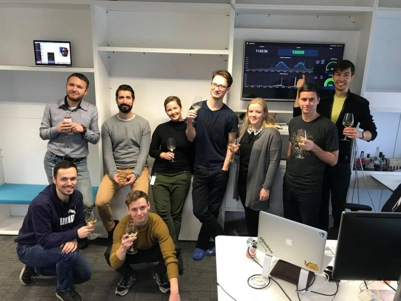

(2017 - 2022)

## Principal Software Engineer, Engineering Platform

- Mission lead for GraphQL subscriptions (~4 developers x 3 months)
- Launchpad lead for a high-load core services team (cross-team communication, reviews, backlog grooming, on-call; ~12 developers x 6 months)
- Hiring interviewer and onboarding instructor (system-design step, 4h+ videos)
- Improved observability of core services
- Mission developer in billing-stack GraphQL updates
- Mission developer in user-overview GraphQL revamp
- Initiator and member of GraphQL guild council (cross-team schema evolution)
- Led open-source efforts ([graphql-schema-registry](https://github.com/pipedrive/graphql-schema-registry))
- Active cross-team and cross-guild communicator

Gained experience in:
- Kafka, Redis Sentinel, PromQL

## Senior Software Engineer, Core Tribe

- Mission lead for API composition introducing a federated GraphQL layer (~4 developers x 3 months)
- Mission lead for API performance improvements (~2 developers x 2 months)
- Solution architect role reviewing mission outcomes
- Mission developer in Mailigen post-acquisition stabilization (campaigns)
- Mission developer in PHP monolith decomposition and dockerization
- Built desktop app proof of concept with Electron
- Contributed to team-owned services:
  - websocket and event delivery service
  - cross-datacenter client data migration service
  - request routing service
  - logging/linting and related libraries
  - back office platform
  - frontend web app platform

Gained experience in:
- Leading projects
- Monitoring: Grafana, Prometheus, Datadog, New Relic
- Frontend: React, Redux
- Backend: Go, Gin
- Pipedrive + FB Messenger integration hackathon

## Senior Software Engineer, Marketplace (Indigo) team

- Developed Pipedrive marketplace catalog, OAuth server, and app manager
- Supported high-load webhook services (encryption)
- Improved API reference page (Swagger UI, search)

Company background: global market, sales SaaS, unicorn startup.

Gained experience in:
- Developing high-load microservices
- Backend: Node, ES6, Redis, Consul, Docker
- Frontend: React, Scss
- QA: Sinon, Mocha, Jest
- Monitoring: New Relic, Prometheus

