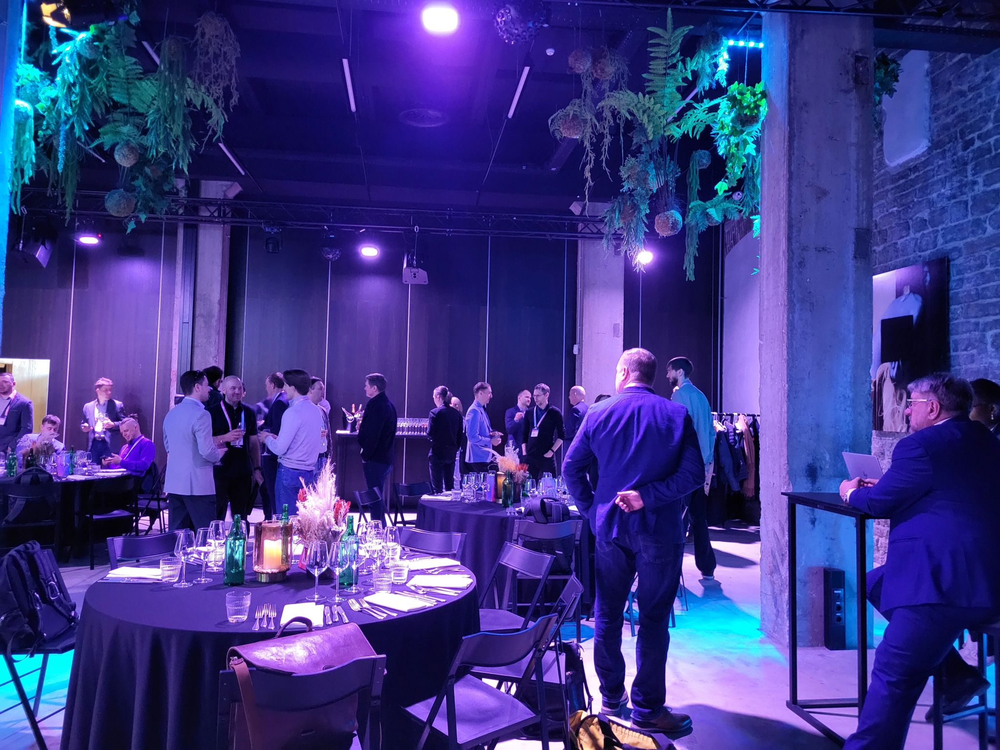
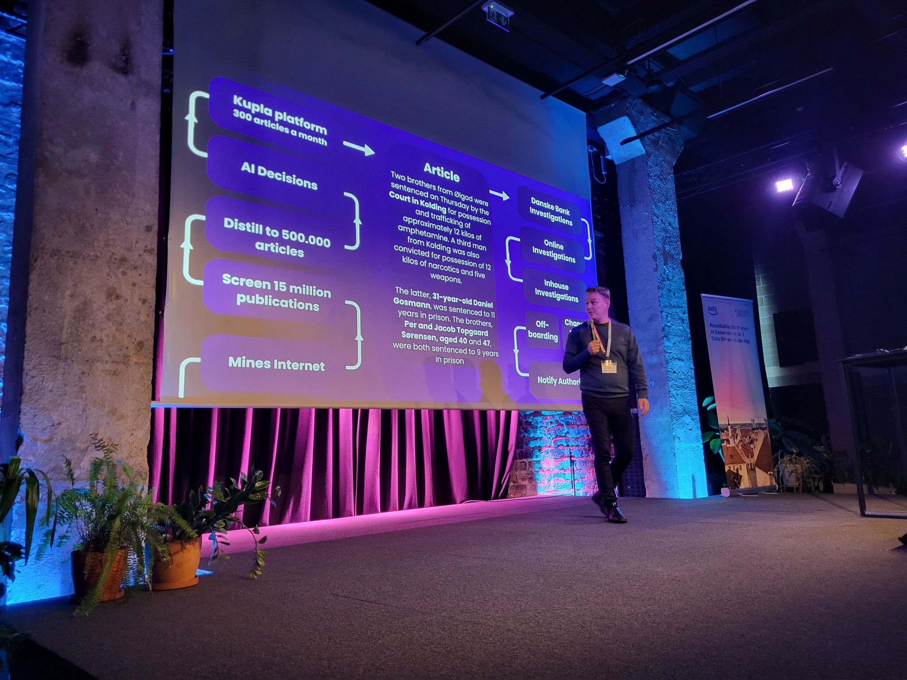
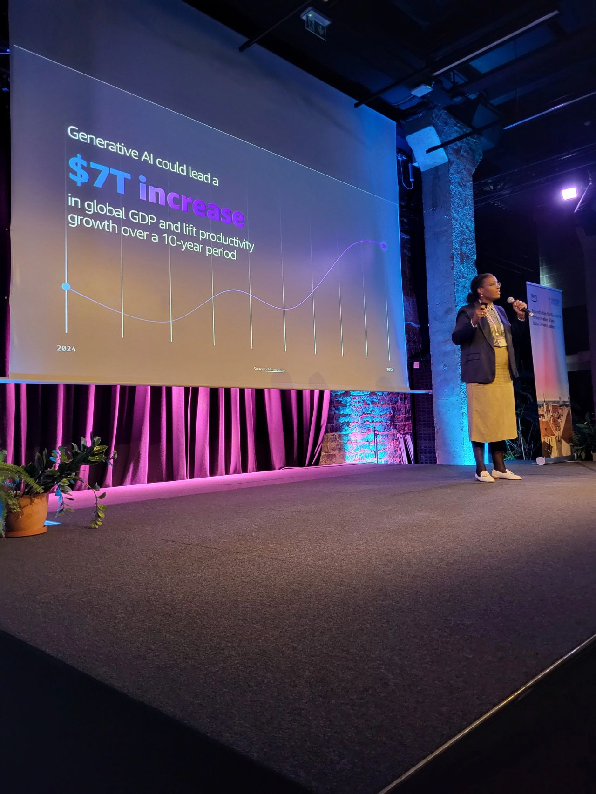

Visited Gen AI meetup organized by AWS. Strangely, the meetup had a "Chatham House Rule" so I'm not sure if I can reveal who talked about what.  
> neither the identity nor the affiliation of the speaker(s), nor that of any other participant, may be revealed  
  
So I'll say that:  
- someone talked about high-level topics. Amazon-specific culture (like "Working backwards", "One-way door vs two-way door", "You build it, you own it"), some of their services, being customer-centric, gathering data, building AI organization. I was interested here in agents. Two things were mentioned - RUFUS (some sort of shopping assistant) and AWS Connect (or was it Agent Assist?) I got lost with names 🫣  
  I liked the demo of an agent taking a call and answering a specific question. Having such transcript to have follow-up emails and analyze data later on is great. I once talked to an AI agent over the phone for 20 minutes and it was good experience too.  
  
- someone talked about business intelligence. Again cultural topic of "juniors can overrule seniors if they have the data" sounded logical. Gave a demo of querying data, getting graphs ([Supersimple](https://www.linkedin.com/company/gosupersimple/) or Databricks came to my mind). I'm not sure it will be that viable with agents, I think they will be capable of querying data from my local machine. Amazon Q agent was mentioned, but nothing specific was shown so I suppose its still in development or wasn't fit for this meeting  
  
- someone talked about a sensitive topic. I may have misunderstood it. But it was about AI tracking news (to combat money laundering?), extracting relevancy to a specific topic. I was triggered that it may be used for AI surveillance, but who knows, maybe GDPR or AI Act is not applicable here. The workflow for processing data seemed complex and impressive though  

And later in networking, I got to talk to a startup that is working on making onboarding for sales/GTM easier using AI. 

<!--truncate-->

Recommended [Clarifai](https://www.linkedin.com/company/clarifai/) as a model training and hosting platform 😊

## People detected in the promotion notes
- Seppo Kalliomaki
- Marys Benge van Megen
- Ezaldeen Arafat
- Michael Lundgaard

