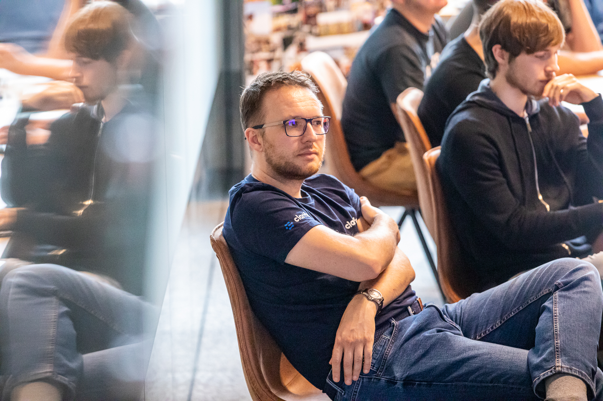
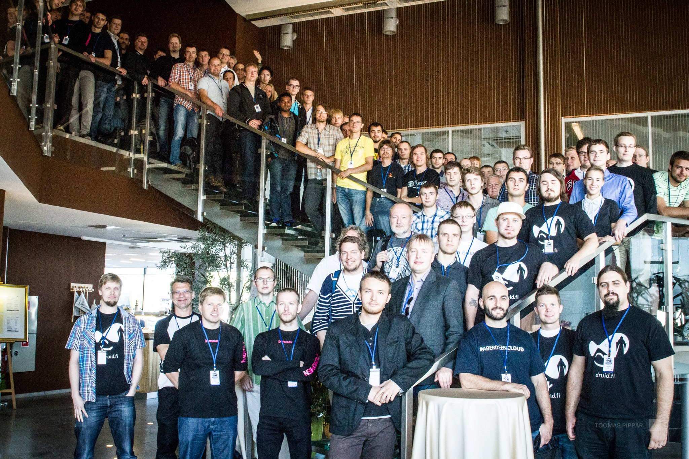
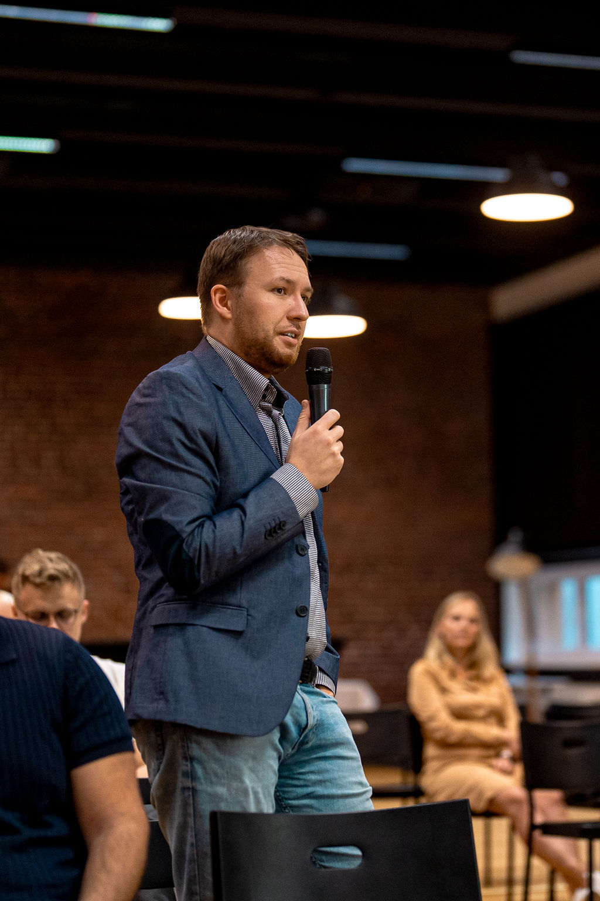

Меня зовут Артём Курапов.  Я отец, инженер-программист, кото- и пчеловод
- У меня много разных мини-проектов
- Я веду личные заметки в стиле второго мозга
- Некоторые из них публикую тут в своем блоге
- Пишу AI музыку когда есть настроение
- Хожу на местные встречи связанные с программитсами и стартапами
	- [девклуб](http://devclub.eu/), TallinnJS, Garage48, Lift99, Palo-Alto, Technopol
- Люблю разные хакатоны где надо за ограниченное время что-то создать
- Ищу новые идеи и проекты, в том числе что-бы кому-то помочь

##  Интересы и направления развития
Это список тем которые я плохо знаю но то что меня осознанно интересует
- робототехника (моторика и зрение)
- наука (астрофизика, микробиология, энтомология)
- видео игры (создание, движки, game design, lore, анимации)
- EDC (ОБЖ, выживание)
- рисование (анатомия, светотень, изометрия)

|  |  |  |
| ------------------------------------------------------------- | ------------------------------------------------------------- | ------------------------------------------------------------ |
|   |                                          |  |

## Образование

- [Таллинский Технический Университет](http://ttu.ee/),  
    Информатика, магистр (2007-2011)
- [Таллинский Технический Университет](http://ttu.ee/),  
    Компьютерная и системная техника, бакалавр (2002-2007)
- [Таллинская Средняя Школа №6  
    ](http://www.kvg.tln.edu.ee/)(Центральная Русская Гимназия) (1993-2002)
- [Харьковская Средняя Школа №4  
    ](http://lyceum4.edu.kh.ua/)(Педагогический Лицей) (1992-1995)

## Профессия

Я начинал работать в небольших студиях которые работали над небольшими проектами для таких клиентов как - [Elisa](http://www.elisa.ee/), [SEB](http://www.seb.ee/), [Sampo Pank](http://www.sampopank.ee/), [Postimees](http://postimees.ee/), [GlaxoSmithKline](http://gsk.ee/), [Reformierakond](http://www.reform.ee/), [IRL](http://www.irl.ee/), [Eesti Raadio](http://www.err.ee/), [RMK](http://rmk.ee/), [Rovio](http://rovio.com/). 

После этого я переключился на работу более долгосрочных проектов [Navigil](https://www.navigil.com/),  [GolfGameBook](https://golfgamebook.com/), . В итоге я стал работать в компаниях-стартапах которые разрабатывают один продукт в течение долгих годов - [Tactic](https://tacticrealtime.com/), [Pipedrive](https://www.pipedrive.com/), [Clarifai](https://clarifai.com/). Это позволяет глубже уйти в проектирование и развитие качества всего стека и мне расти в роли Т-образного fullstack разработчика

Я люблю изучать и проектировать сложные системы, потоки информации во временных и пользовательских контекстах с ограничениями платформы. Поэтому я занимаюсь их  **интеграцией**  и тестированием. Я знаю что на практике значат модные слова - CMS, CRM, ECM, онлайн-магазины, API социальных сетей, мобильные приложения.

#### Опыт работы с тех-стеками

| Языки                  | Typescript, Go, Python, PHP                                                                                                                                                                 |
| ---------------------- | ------------------------------------------------------------------------------------------------------------------------------------------------------------------------------------------- |
| Базы данных            | Postgres, MySQL, MongoDB                                                                                                                                                                    |
| Backend фреймворки     | Gqlgen Fastify, Koa, Express Zend Framework, Code igniter, Yii, Kohana, Symfony                                                                                                       |
| Разработка и поддержка | PHPUnit & SeleniumRC/Grid, SVN, Git, Jenkins, Webgrind, XDebug, XHProf Bower, Karma, Grunt, Jasmine                                                                                         |
| API                    | Социальные сети (Facebook,Twitter,Google,Linkedin) Бухгалтерия (Hansaworld, Economics) Оплата (DIBS, Cybersource, Fortumo) Специализированные (Micros MyFidelio, Xtee, Mobiil-ID & Digidoc) |
| Трекеры                | Trello, Pivotaltracker, Mantis, Jira                                                                                                                                                        |
| Frontend фреймворки    | React, Angular 1, Backbone                                                                                                                                                                  |
