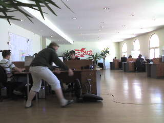
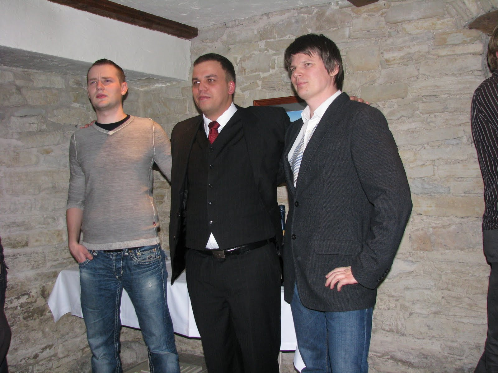
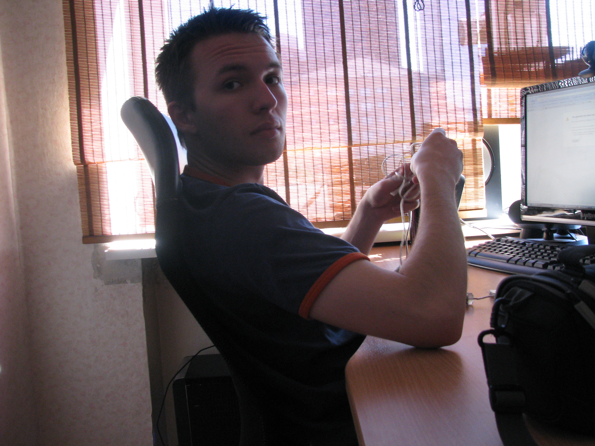

(2008 - 2011)

- Разработал SSO в CMS для всех проектов с защищённым протоколом
- Реализовал индексацию поиска в CMS
- Делал краткосрочные проекты, например:
  - `masterkeep.com` - управление активами для страхования: оплаты, купоны, бухгалтерия, PDF-отчёты
  - `arst.ee` - вопросы и ответы от посетителей к врачам, интеграция оплаты
  - `penosil.ee`

Эстонский и американский рынок, веб-разработка и стартап-компания.
Отвечал за интеграцию CMS (LAMP stack).

Внедрил:
- Использование внешних ключей InnoDB для лучшего понимания схем MySQL и целостности данных

Получил опыт с:
- командной работой, Scrum, стандартами форматирования кода
- delta-скриптами миграций БД
- jQuery, Mobile-ID

## Проекты

| Название | Описание |
| --- | --- |
| Bi | Очень интересный и большой проект. Увы, под жёстким NDA. Работа с MongoDB и поисковыми системами. |
| [Prettyfolks.com](http://www.prettyfolks.com/) | Небольшой сайт по платному улучшению фото для соцсетей. Конвейерная обработка изображений, защита случайно расположенными водяными знаками, оплата через PayPal. |
| [Laenuvaidlus.ee](http://laenuvaidlus.ee/) | Генерация документов по данным из форм, шаблонов и бизнес-правил. Интеграция html2ps для PDF с криптозащитой и DigiDoc для подписи. Позже добавили Itella для отправки счетов и Swedbank gateway для оплаты по viitenumber. |
| [Baumax.ee](http://baumax.ee/) | **Магазин** стройматериалов с очень сложной логикой ценообразования по региону клиента (индекс), размеру товара и типу поддона. |
| SEB ISIC quiz | Банковский тест/квиз по продвижению студенческой/дебетовой карты. Делал Facebook-интеграцию с общей логикой работы. |
| Arst.ee koolitus keskond | Платформа обучающих программ (лекции, материалы, тесты, результаты, участники). Тяжёлый проект (6+ человеко-месяцев), интеграция Scribd. |
| [Grand Rose](http://grandrose.ee/) | [Отличный отель](http://kurapov.name/rus/pleasure/places/grand_rose_spa_trip/) на Сааремаа. Небольшие багфиксы. |
| [Gild bankers](http://www.gildbankers.com/) | Инвестиционная компания, небольшие багфиксы. |
| [Advisio](http://www.advisio.ee/) | Консультационная компания, обновление продакшена. |
| [Tehnopol](http://www.tehnopol.ee/) | Сайт научного комплекса в Таллинне возле ТТУ. Небольшая интеграция. |
| [Travelmerchant](http://www.travelmerchant.eu/) | Обновление продакшена, мелкие фиксы, интеграция базового дизайна. |
| [Hiv.ee](http://www.hiv.ee/) | Сайт-инфоброшюра о СПИДе для Института развития здоровья. |
| [Tireman](http://www.tireman.ee/) | Компания под брендом Vianor, продажа шин и дисков. Исправлял модуль магазина. |
| [Arst.ee](http://arst.ee/) | Медицинский портал: вопросы/ответы, события, профиль, врачи, лекарства. Параллельно делал русскую и английскую версии. |
| [Archimedes](http://archimedes.ee/) Intranet | Создание основы для CRM: таблицы и связи компаний, сотрудников, контактов на InnoDB с FK. |
| Ядро Exact CMS | Написал модули тегов и центральную авторизацию для всех проектов, добавил поддержку Nordea pangalink. |
| [Dunas Douradas Beach Club](http://www.ddbc.pt/) | Сайт португальского курорта: бэк-офис работал на .NET, но контент удобнее было показывать/редактировать в CMS на PHP. Делал первичную интеграцию с HTML и прокси .NET. |
| [Masterkeep.com](http://masterkeep.com/) | Крупный проект (более 4 человеко-месяцев), ключевые решения в оплатах и продлении аккаунтов: интеграции кредитных сервисов и биллинга. Активно использовался jQuery. Отчёты PDF через pdftk с ajax-прогрессом и склейкой страниц. Многоязычность (3+ языка) потребовала доработки древовидных модулей. |
| Folk.ee | Сайт фестиваля эстонской народной музыки. Делал модуль оплаты с логом транзакций, подключал pangalink банков (включая Nordea), CSV-экспорт и фильтрацию логов для админки. |
| [Penosil.ee](http://penosil.ee/) | Международная компания стройматериалов. Устанавливал и сильно дорабатывал каталог продуктов, писал XML-парсер импорта дерева с изображениями/файлами для 7 языков, адаптировал сайт под 21 страну. |

