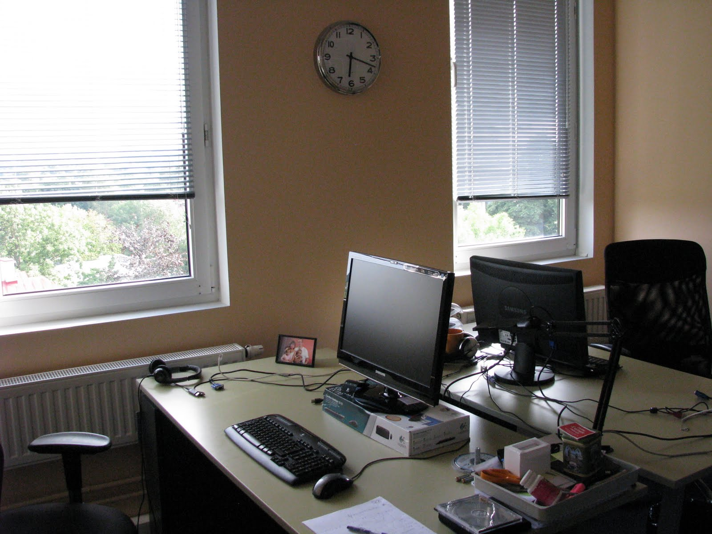

(2008 - 2011)

- Разрабатывал среднесрочные проекты, например:
  - Rovio.com - публичный сайт компании Angry Birds
  - Elisa.ee - мобильные сервисы, интернет-магазин и CMS, сравнение продуктов, роуминг
  - Pling.ee - мобильная соцсеть: SMS-шлюз, лента пользователя, друзья, группы, Android-приложение
  - Laenuvaidlus.ee - анализ нарушений кредитного законодательства, бизнес-правила, экспорт PDF, цифровые подписи

О компании: эстонский и американский рынок, компания веб-разработки, выросшая из Exact.

Получил опыт с MongoDB, Yii framework, Pivotal Tracker, разработкой Android-приложений (Java + Eclipse), PHPStorm, базовым Ubuntu и Bash.

Внедрил юнит-тестирование на PHPUnit, Selenium Grid для автотестов на нескольких ОС и Jenkins CI.

## Проекты

| Название | Описание |
| --- | --- |
| [Rovio.com](http://rovio.com/) | Сайт финской компании, выпустившей самую известную мобильную игру: интеграция сайта, XML-импорт данных, модуль карьеры. |
| Edream | Централизованный сервис регистраций в отелях, в частности mycityhotel.ee. |
| [Uncram.com](http://kurapov.name/content/://uncream.com) | **Стартап**, социальная сеть с тесной браузерной интеграцией, MongoDB и масштабированием Amazon/RightScale. Делал авторизацию через Facebook/Twitter/Google и копирование списков контактов. |
| [Pling.ee](http://pling.ee/) | Молодёжная соцсеть, похожая на Twitter/Facebook, с бесплатным общением через SMS/MMS и определением местоположения по телефону. Хитрая агрегация и фильтрация, автотесты Selenium, синхронизация с соцсетями, XML API, Android-приложение. |
| [Elisa.ee](http://elisa.ee/) | Международный телеком-оператор (мобильная связь, интернет, ТВ). Занимался интеграцией дизайна основного сайта, рефакторингом ключевых модулей, модулями роуминга (XML-импорт и таблица) и доменов, серьёзно дорабатывал модуль магазина. Настроил сервер continuous integration. |
| Elisa mint | Frontend-панель управления беспроводным интернетом (начало/конец сессии, оплата). Делал интеграцию дизайна, оплаты и связи с бэкенд-сервисами. |
| [Efis](http://efis.ee/) | База данных эстонского кино. Сложный autocomplete, авторизация через соцсети. |
| FU info | Сайт о финно-угорских народах, базовая интеграция. |
| Danske Pank | Сайт кампании по продвижению пенсионной программы. Сделал небольшую форму регистрации с валидацией. |
| [Skano](http://skano.ee/) | Международная мебельная компания. Интегрировал [планировщик мебели](http://www.skano.com/3D/) на Flash с бэкендом и делал багфиксы на официальном и отдельных сайтах. |
| [Puhastaja Kaubamaja](http://www.puhastajakaubamaja.ee/) | **Магазин** средств очистки помещений. Делал большую двустороннюю синхронизацию с [Hansaworld](http://www.excellent.ee/) (бухгалтерия/склад, с юнит-тестами), а также часть модуля магазина и пользовательских настроек с несколькими ролями и привилегиями. |

