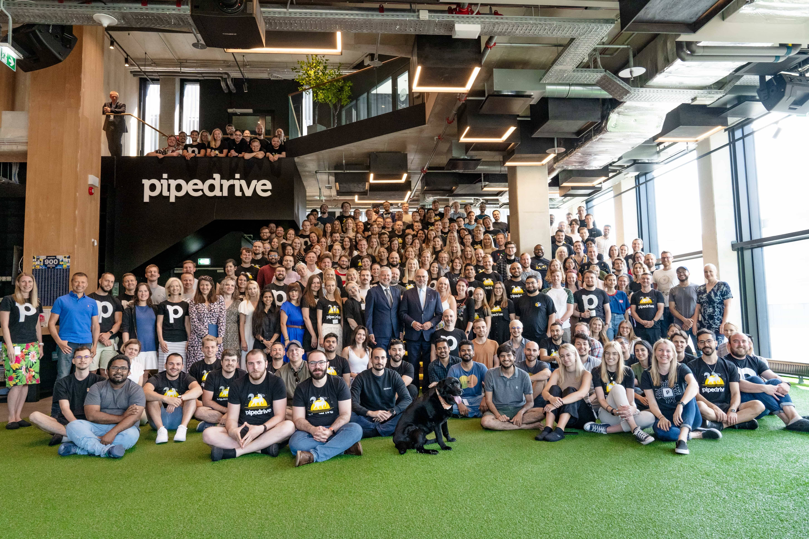
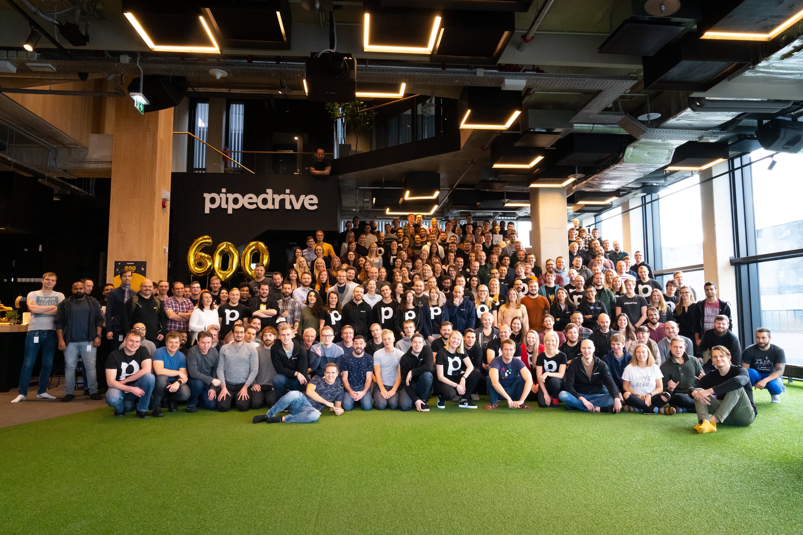
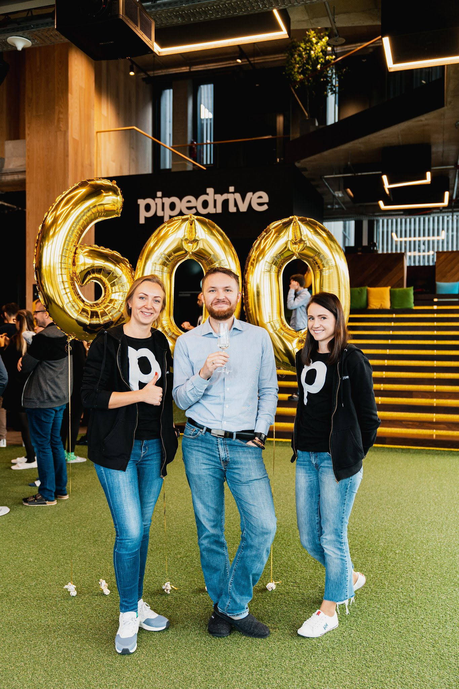
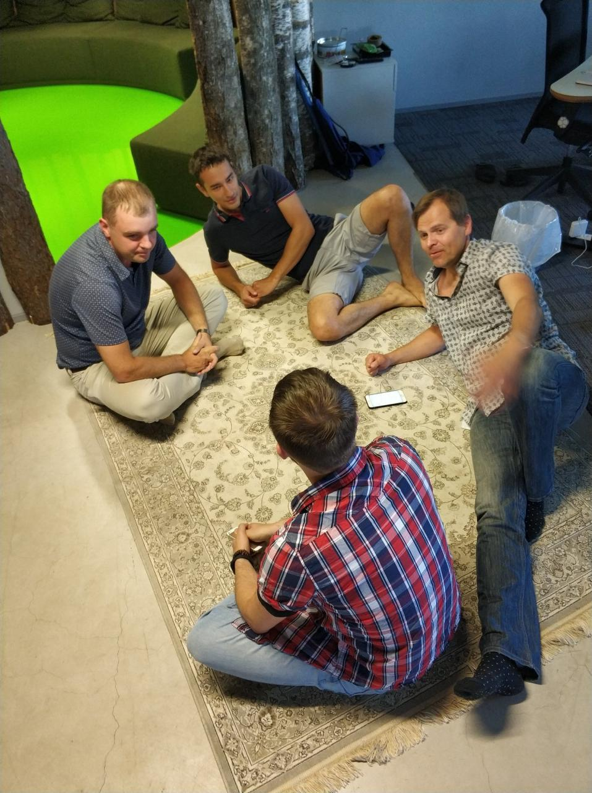
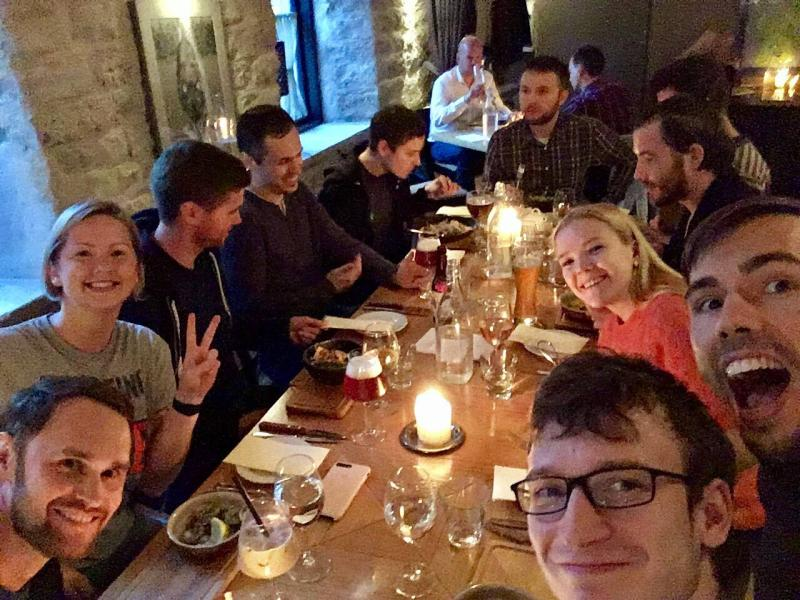
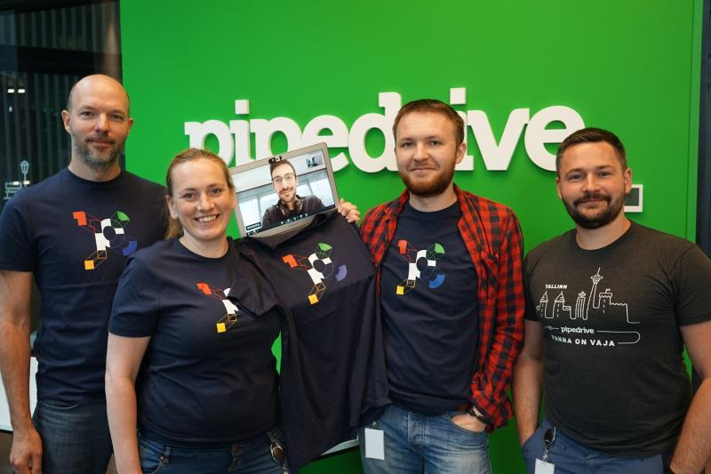
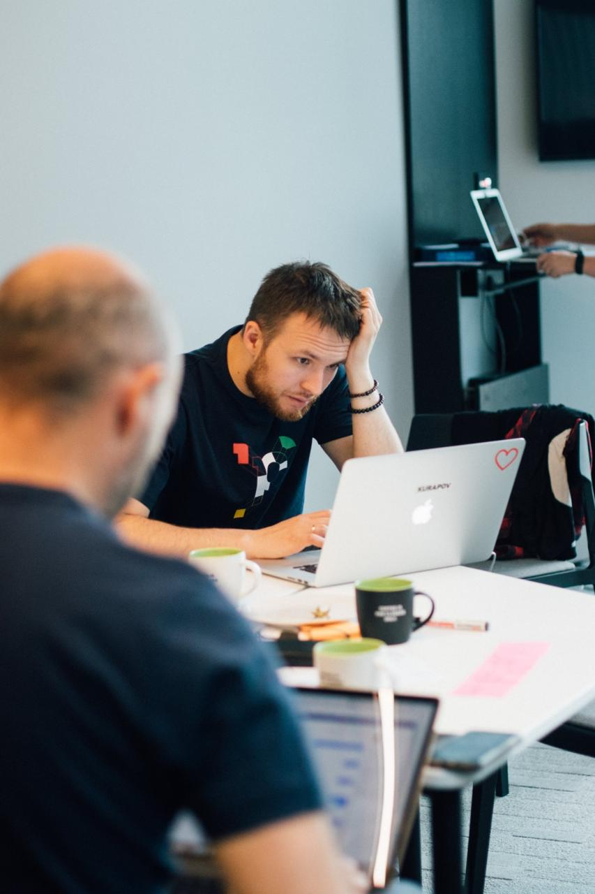

(2017 - 2022)

## Principal Software Engineer, Engineering Platform

- Лид миссии по GraphQL-подпискам (~4 разработчика x 3 месяца)
- Launchpad-лид high-load команды core services (межкомандные коммуникации, ревью, груминг бэклога, on-call; ~12 разработчиков x 6 месяцев)
- Интервьюер и наставник онбординга (этап system design, видео 4+ часа)
- Улучшил наблюдаемость core-сервисов
- Разработчик миссии по обновлению GraphQL в биллинговом стеке
- Разработчик миссии по переработке GraphQL в user overview
- Инициатор и участник совета GraphQL guild (эволюция схемы между командами)
- Лид open-source направления ([graphql-schema-registry](https://github.com/pipedrive/graphql-schema-registry))
- Активная коммуникация между командами и guild

Получил опыт в:
- Kafka, Redis Sentinel, PromQL

## Senior Software Engineer, Core Tribe

- Лид миссии API composition с внедрением federated GraphQL-слоя (~4 разработчика x 3 месяца)
- Лид миссии по улучшению производительности API (~2 разработчика x 2 месяца)
- Роль solution architect при ревью результатов миссий
- Разработчик миссии стабилизации продукта Mailigen после acquisition (campaigns)
- Разработчик миссии по разделению PHP-монолита и dockerization
- Сделал PoC десктоп-приложения на Electron
- Вкладывался в сервисы команды:
  - сервис доставки WebSocket-событий
  - сервис миграции клиентских данных между датацентрами
  - сервис маршрутизации запросов
  - библиотеки логирования, линтинга и др.
  - backoffice как платформа
  - frontend web app как платформа

Получил опыт в:
- лидерстве в проектах
- мониторинге: Grafana, Prometheus, Datadog, New Relic
- frontend: React, Redux
- backend: Go, Gin
- хакатоне по интеграции Pipedrive + FB Messenger

## Senior Software Engineer, Marketplace (Indigo) team

- Разрабатывал каталог Pipedrive Marketplace, OAuth-сервер и app manager
- Поддерживал высоконагруженные webhook-сервисы (encryption)
- Улучшал страницу API reference (Swagger UI, поиск)

О компании: глобальный рынок, SaaS для продаж, unicorn-стартап.

Получил опыт в:
- разработке high-load микросервисов
- backend: Node, ES6, Redis, Consul, Docker
- frontend: React, Scss
- QA: Sinon, Mocha, Jest
- мониторинг: New Relic, Prometheus

