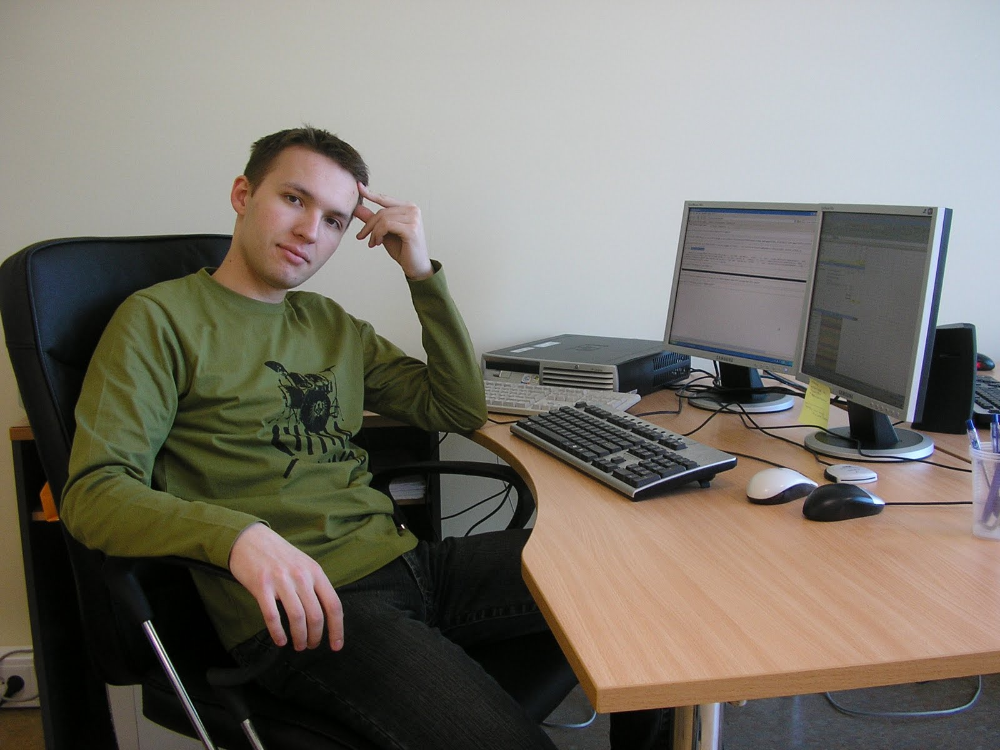
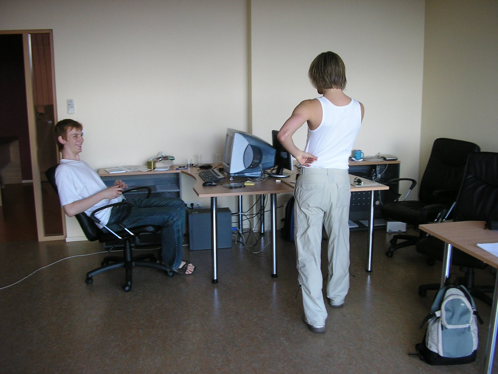
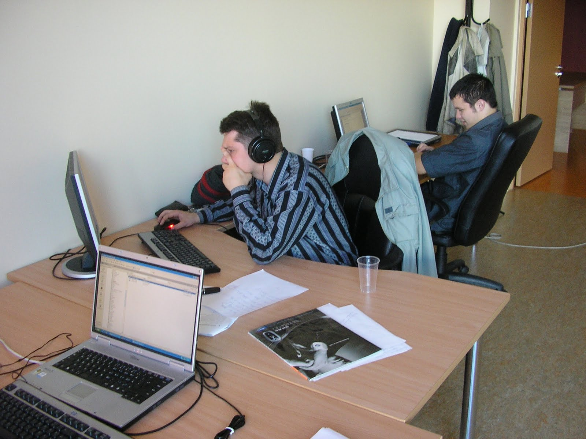

(2006 - 2007)

[Web Expert](http://we.ee/)

- Разрабатывал краткосрочные проекты на кастомной CMS (LAMP stack), например:
  - SICP: таможня и образование, парсинг Docx, поиск по дереву с подсветкой, импорт из MS Access
  - EIQA: аудит очистки, тяжёлые формы, экспорт PDF, процессные workflow, клиенты

О компании: эстонский рынок, веб-разработка

Получил опыт работы с большими базами MySQL. Первый опыт с Oracle. Разрабатывал кастомные модули CMS и приложения с интересными алгоритмами (поиск по дереву, распределённое управление сессиями), Pangalink, WSDL для SOA, Zend IDE.

## Проекты

| Название | Описание |
| ------------------------------------------- | ------------------------------------------------------------------------------------------------------------------------------------------------------------------------------------------------------------------------------------------------------------------------------------------------------------------------- |
| SEB ISIC promo | Промо-сайт банка SEB по продвижению студенческой карты. Механика роста: приглашение друзей за баллы, которые можно было тратить как в магазине. |
| [Baltcap](http://baltcap.ee/) | Сайт венчурной группы инвесторов Балтии. Делал модуль файлов, категорий, пользователей. |
| [SOA trader](https://www.soatrader.com/) | Сайт по [продаже](http://www.tehnopol.ee/?id=12371) веб-сервисов с service-oriented architecture. Фактически обменный пункт и магазин. |
| [OilExpress](http://oilexpress.info/) | Древовидное меню с файлами, статьями и папками. Простая система привилегий доступа. Немного Ajax для удобства и валидации. |
| [Bikeworld](http://www.bikeworld.ee/) | Компания по продаже мотоциклов. Установка стандартной CMS, настройка админпанели и модулей каталога товаров. |
| [Stamina](http://www.stamina.ee/) | Компания спортивных мероприятий. Исправления модуля регистрации. |
| [iraadio](http://iraadio.ee/) | Сайт авторской эстонской музыки. Создание галереи с автоизменением размеров загружаемых картинок, квадратным thumbnail-crop с позиционированием, SMS-gateway доступом к оригиналам, рейтингом и комментариями. |
| [Uuno.ee](http://www.uuno.ee/) | Эстонское радио: перенос сайта с редиректами и мелкими правками дизайна. |
| [Europcar](http://www.europcar.ee/) | Компания по аренде авто. Подключал модули бронирования, автопарка, баннеров и контакт-формы к публичной части CMS. |
| [Teletekno](http://www.teletekno.ee/) | Компания по "железу". Переделывал старый каталог, добавлял артикулы, [WYSIWYG](http://en.wikipedia.org/wiki/WYSIWYG), структуру публичной части. |
| [Upop](http://www.u-pop.ee/) | Эстонское поп-радио: около 300 тыс. пользователей, очень старая система, 800+ таблиц и более 10 ГБ. Делал раздел плейлистов из музыки сайта, статистику прослушиваний и платную часть. |
| SICP (Shippers Internal Control Program) | Standalone-проект под спонсорством США в рамках поддержки развивающихся стран. Система электронного обучения и таможенной проверки. Делал древовидное меню и работу с контентом, парсер MS Word 2003 XML для импорта структуры, поиск с подсветкой ключевых слов, привязку меню к привилегиям пользователя, импорт данных из MS Access (включая изображения). |
| [Sivex](http://www.sivex.ee/) | Реализовал авторизацию с использованием [ID-карты](http://www.id.ee/) гражданина Эстонии. Сделал мониторинг длины очередей на погранпунктах Эстонии с хронологическим вводом и построением графика. |
| [Pärnumaa kylatee](http://www.parnumaa.ee/) | Закрытая система провайдера беспроводного интернета для удалённых деревень. Учёт платежей, статуса соединения, проблем клиентов и задач сотрудников. Импорт/экспорт XML для бухгалтерии, SMS-оповещения, генерация PDF-счёта. |
| [Pärnu haigla](http://www.ph.ee/) | Небольшие изменения модуля новостей. |
| [EIQA](http://www.eiqa.com/) | Анализ кода и внутренней системы аудита/качества. Глубокие изменения логики форм (100+ строк ввода) с математической обработкой. Генерация PDF из HTML. Использование crontab для контроля времени жизни процессов. |
| [Salinger](http://www.salinger.ee/) | Установка модуля рассылки и изменение порядка вводимых данных. |
| [Kinder](http://www.kinder.ee/) | Изменения ввода данных в корзину магазина игрушек и обработки до/после оплаты через банк. Форма расчёта даты доставки на JavaScript. Установка CSS-стилей, изменение шаблонов, установка модуля рассылки. |
| GSK | GlaxoSmithKline - крупнейший производитель медицинских препаратов. Установка CMS, доработка feedback/usermanagement/banner модулей, установка шаблонов. Полный порт CMS с [MySQL](http://en.wikipedia.org/wiki/Mysql) на [Oracle](http://en.wikipedia.org/wiki/Oracle_database), первый опыт Oracle. |
| [Kommest](http://www.kommest.ee/) | Изменения в CMS-модуле feedback. |

