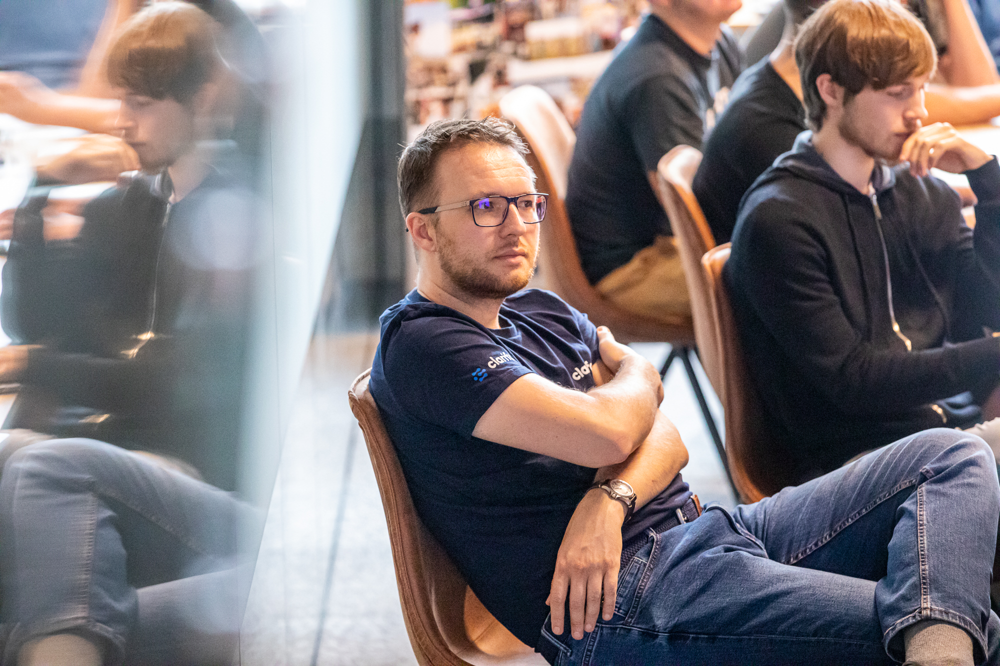
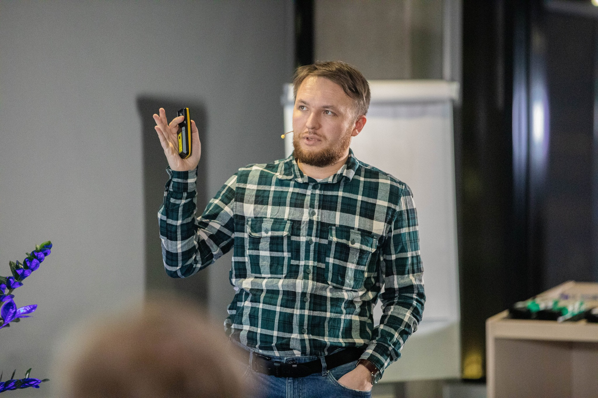
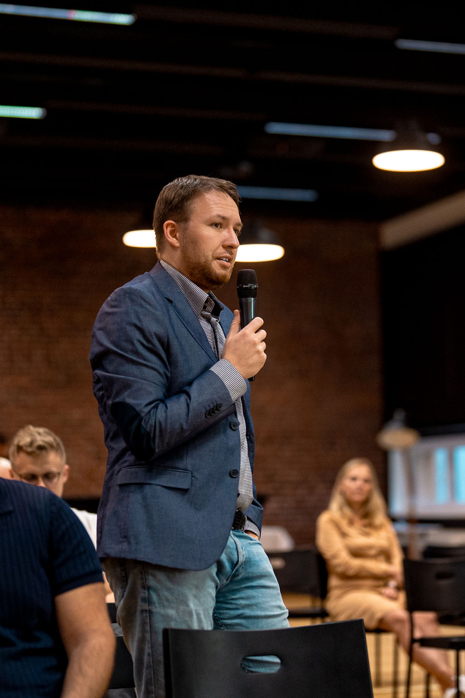

Меня зовут Артём Курапов, я инженер из Эстонии. 
Активно участвую в [девклубе](http://devclub.eu/), TallinnJS, местных стартап-сообществах и конференциях.
Анализирую закономерности и пишу свои заметки в блоге и youtube.

Я начинал работать в небольших студиях которые работали над небольшими проектами для таких клиентов как - [Elisa](http://www.elisa.ee/), [SEB](http://www.seb.ee/), [Sampo Pank](http://www.sampopank.ee/), [Postimees](http://postimees.ee/), [GlaxoSmithKline](http://gsk.ee/), [Reformierakond](http://www.reform.ee/), [IRL](http://www.irl.ee/), [Eesti Raadio](http://www.err.ee/), [RMK](http://rmk.ee/), [Rovio](http://rovio.com/). 

После этого я переключился на работу более долгосрочных проектов. В итоге я стал работать в компаниях-стартапах которые разрабатывают один продукт в течение долгих годов. Это позволяет глубже уйти в проектирование и развитие качества всего стека. 

Долгое время я пытался писать самостоятельные проекты, например CMS для своего блога. 
Сейчас я разрабатываю свой стартап по пчеловодству - [Gratheon](http://gratheon.com/).

## Образование

- [Таллинский Технический Университет](http://ttu.ee/),  
    Информатика, магистр (2007-2011)
- [Таллинский Технический Университет](http://ttu.ee/),  
    Компьютерная и системная техника, бакалавр (2002-2007)
- [Таллинская Средняя Школа №6  
    ](http://www.kvg.tln.edu.ee/)(Центральная Русская Гимназия) (1993-2002)
- [Харьковская Средняя Школа №4  
    ](http://lyceum4.edu.kh.ua/)(Педагогический Лицей) (1992-1995)

## Профессия

Я люблю изучать и проектировать сложные системы, потоки информации во временных и пользовательских контекстах с ограничениями платформы. Поэтому я занимаюсь их  ****интеграцией****  и тестированием. Я знаю что на практике значат модные слова - CMS, CRM, ECM, онлайн-магазины, API социальных сетей, мобильные приложения.

#### Опыт работы с технологиями

|                        |  |
| ---------------------- | -------- |
| Языки                  | Go, Python, PHP, Typescript/Javascript (ES6+, Node) |
| Базы данных            | MySQL5+ (FK, транзакции), Postgre, Oracle 10, MongoDB                                                                                                                                       |
| Backend фреймворки     | Koa, Express, Zend Framework, Code igniter, Yii, Kohana, Symfony                                                                                                                            |
| Разработка и поддержка | PHPUnit & SeleniumRC/Grid, SVN, Git, Jenkins, Webgrind, XDebug, XHProf Bower, Karma, Grunt, Jasmine                                                                                         |
| API                    | Социальные сети (Facebook,Twitter,Google,Linkedin) Бухгалтерия (Hansaworld, Economics) Оплата (DIBS, Cybersource, Fortumo) Специализированные (Micros MyFidelio, Xtee, Mobiil-ID & Digidoc) |
| Трекеры                | Trello, Pivotaltracker, Mantis, Jira                                                                                                                                                        |
| Frontend фреймворки    | React, Backbone, AngularJS                                                                                                                                                                  |

#### Стеки по годам

| Age     | Backend                                      | Frontend                           | Domain         |
| ------- | -------------------------------------------- | ---------------------------------- | -------------- |
| Детство | QBasic -> C -> Delphi -> Java                |                                    |                |
| 20+     | PHP + MySQL + Nginx + Vagrant                | jquery, protojs, angular, backbone | CMS, CRMs      |
| 30+     | Node + Go + GraphQL + Docker                 | backbone, react, typescript        | single-product |
| ...     | Go + Postgres + Python + Node (preact) + K8S | preact, typescript                 | AI & robots    |

|                                         |  |  |  |
| ------------------------------------------------------------ | ------------------------------------------------------------ | -- | -- |
