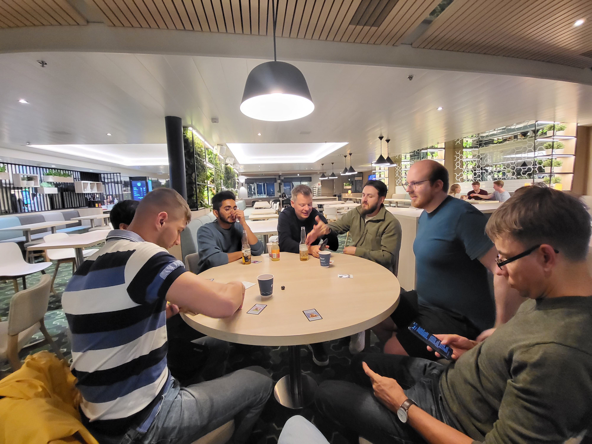
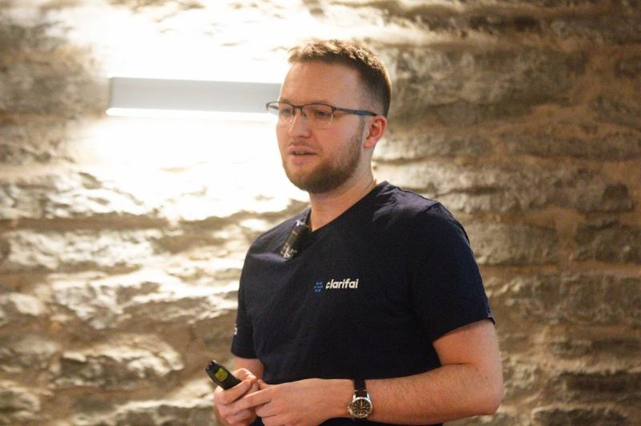

Company background: Global market, software as a service, Fullstack AI platform, startup

## Senior Software Engineer

▪Worked on auto-annotations feature
▪Improving video handling - importing from youtube, increasing max limit, async processing, playback  
▪Supporting datasets, labeling & reviewing tasks, workflows  
▪Improving DX & CI - PR check speed cut by 50%  
▪Improving tests  
▪Interviewing, On-call work  

<iframe width="100%" height="400" src="https://www.youtube.com/embed/CD25FaeqVRc" title="Auto Annotate Your Entire Data with a Single Click: Auto Annotation Explained!" frameborder="0" allow="accelerometer; autoplay; clipboard-write; encrypted-media; gyroscope; picture-in-picture; web-share" referrerpolicy="strict-origin-when-cross-origin" allowfullscreen></iframe>

