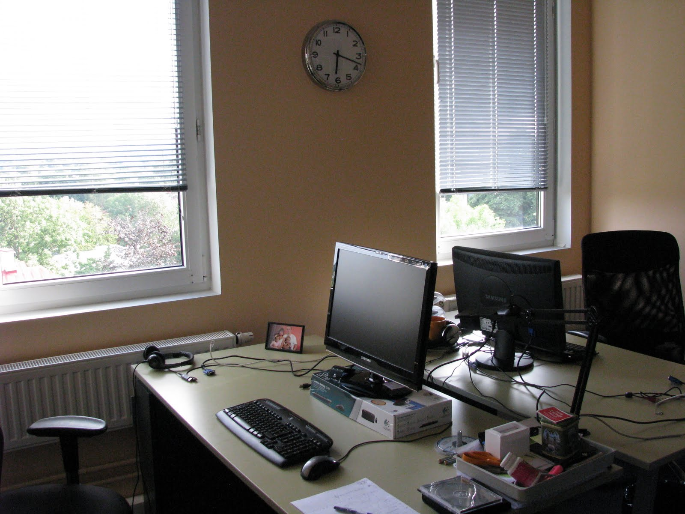
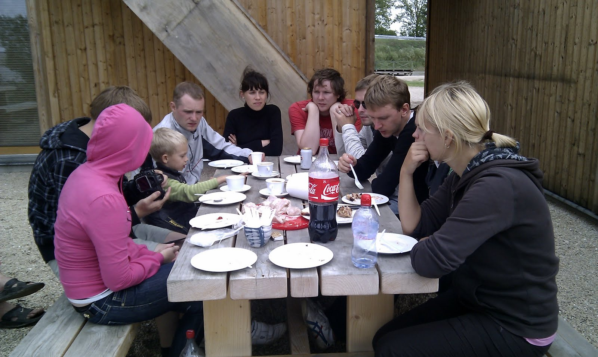
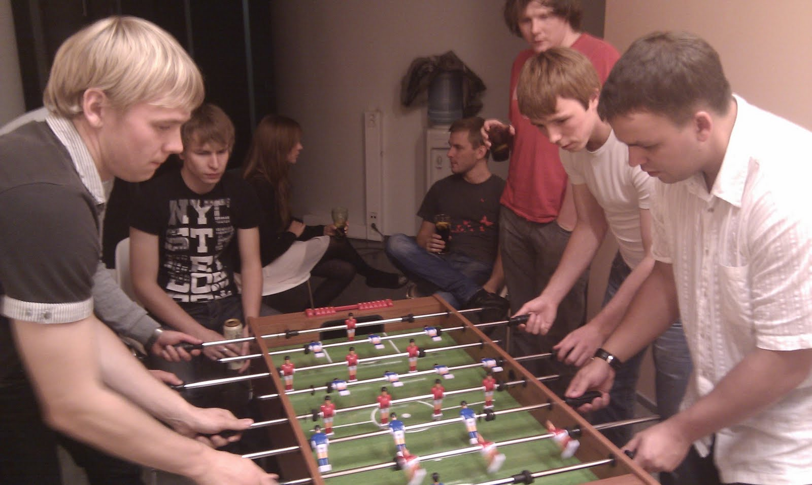

среда, 30 октября 2013 г. в 22:40:32

▪ Developed medium-term projects, such as:
- Rovio.com - famous angry birds company public website
- Elisa.ee - Mobile services. Online shop & cms. Product comparison, roaming
- Pling.ee - Mobile social network. SMS gateway, user feed, friends, groups, android app
- Laenuvaidlus.ee - Loan law breaking analysis. Business rules, pdf export, digital signatures

Company background: estonian & USA market, web-development company, grew out of Exact

Gained experience with MongoDB, Yii framework, Pivotal tracker, Android application development with Java+Eclipse, PHPStorm, basic Ubuntu & bash usage.

Introduced unit testing with PHPUnit, selenium grid automated testing on multiple OS, Jenkins continuous integration server

## Проекты

| Название | Описание |
| --- | --- |
| [Rovio.com](http://rovio.com/)                           | Сайт финской компании, выпустившей самую известную игру для мобильных платформ - интеграция сайта,XML-импорт данных, модуль карьер                                                                                                                                                                                              |
| Edream                                                   | Централизованный сервис регистраций в различные отели. В частности mycityhotel.ee.                                                                                                                                                                                                                                              |
| [Uncram.com](http://kurapov.name/content/://uncream.com) | **Стартап**, социальная сеть с тесной браузерной интеграцией, mongodb, amazon/rightscale масштабированием. Делал авторизацию с помощью facebook, twitter, google и копирование списков контактов.                                                                                                                               |
| [Pling.ee](http://pling.ee/)                             | Молодёжная социальная сеть похожая на твиттер и фейсбук с возможностью бесплатного общения через SMS и MMS и определением местоположения по телефону. Хитрая агрегация и фильтрация, автоматическое тестирование с selenium, синхронизация с социальными сетями, XML API, андроид приложение.                                   |
| [Elisa.ee](http://elisa.ee/)                             | Elisa - международный телеком-оператор, включающий мобильную связь, интернет, телевидение. Я занимался интеграцией дизайна основного сайта, рефакторинг кода основных модулей, написал модули роамингов (xml импорт и показ таблицы) и доменов, основательно изменял модуль магазина. Настроил continuous integration - сервер. |
| Elisa mint                                               | Front-end панели управления беспроводного интернета (начало/конец сессии, оплата). Делал интеграцию дизайна, оплату, связь с основными сервисами бэкэнда                                                                                                                                                                        |
| [Efis](http://efis.ee/)                                  | База данных эстонского кино. Сложные autocomplete, авторизация через социальные сети                                                                                                                                                                                                                                            |
| FU info                                                  | Сайт о финно-угорских народах, базовая интеграция                                                                                                                                                                                                                                                                               |
| Danske Pank                                              | Сайт кампании по продвижению пенсионной программы для клиентов. Делал небольшую форму регистрации с валидацией                                                                                                                                                                                                                  |
| [Skano](http://skano.ee/)                                | Международная мебельная компания. Интегрировал [планировщик мебели](http://www.skano.com/3D/) во флеше с бэкэндом и небольшие багфиксы на официальном сайте и отдельн                                                                                                                                                           |
| [Puhastaja Kaubamaja](http://www.puhastajakaubamaja.ee/) | **Магазин** средств очистки помещений. Делал обширную двустороннюю синхронизацию данных с системой бухгалтерии и складирования [Hansaworld](http://www.excellent.ee/) (с unit-тестами) и частично модуль магазина и пользовательских настроек с несколькими ролями и привилегиями                                               |

