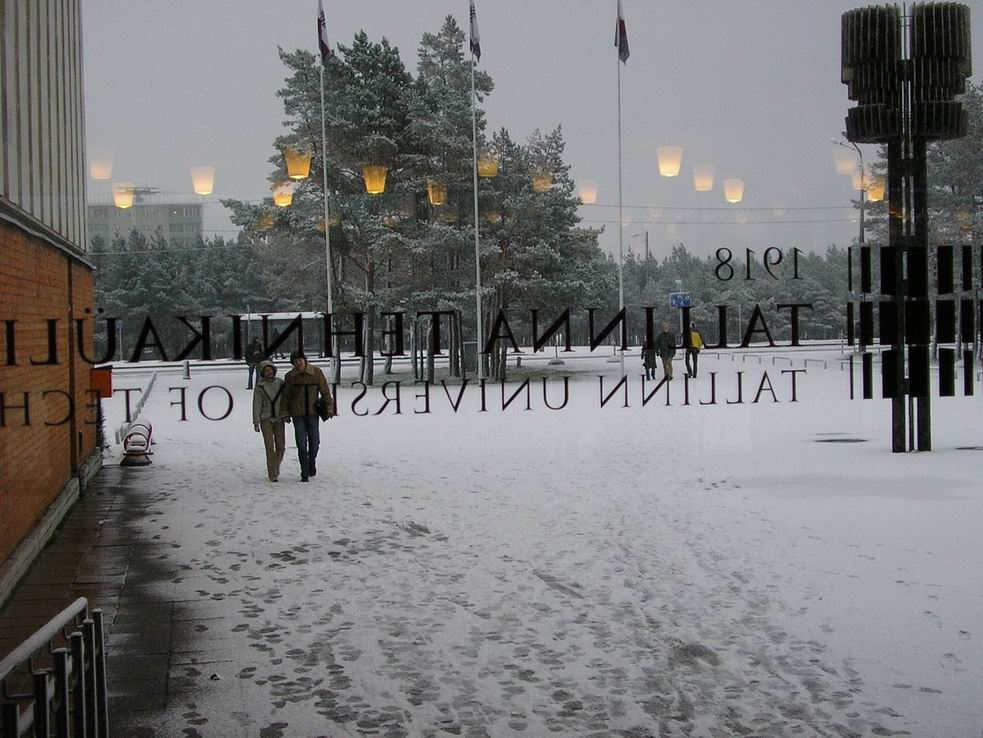

На дипломную работу бакалавра я решил напистать web-crawler с технологиями которые в тот момент я знал. Google был очень популярен и мне интересно было понять нюансы сетевого обхождения какой-то области интернета.

Смотря назад, почти спустя 20 лет, конечно выбор php не самый лучший с точки зрения эффективности. Но работа называлась agile потому что он был относительно прост и легко мог меняться из-за простой  связки между кодом и БД. Я пытался переизобрести ORM и быстро делать простые CRUD операции.

[**Agile web-crawler: design and implementation**](pdfs/bsc-work.pdf) (pdf)

Близкие работы которые могут быть полезны
- [The Anatomy of a Large-Scale Hypertextual Web Search Engine](pdfs/The%20Anatomy%20of%20a%20Large-Scale%20Hypertextual%20Web%20Search%20Engine.pdf)
- [Crawling the Web](pdfs/Crawling%20the%20Web.pdf)
- [ Focused crawling: a new approach to topic-specific Web resource discovery](pdfs/Focused%20crawling.pdf)
  