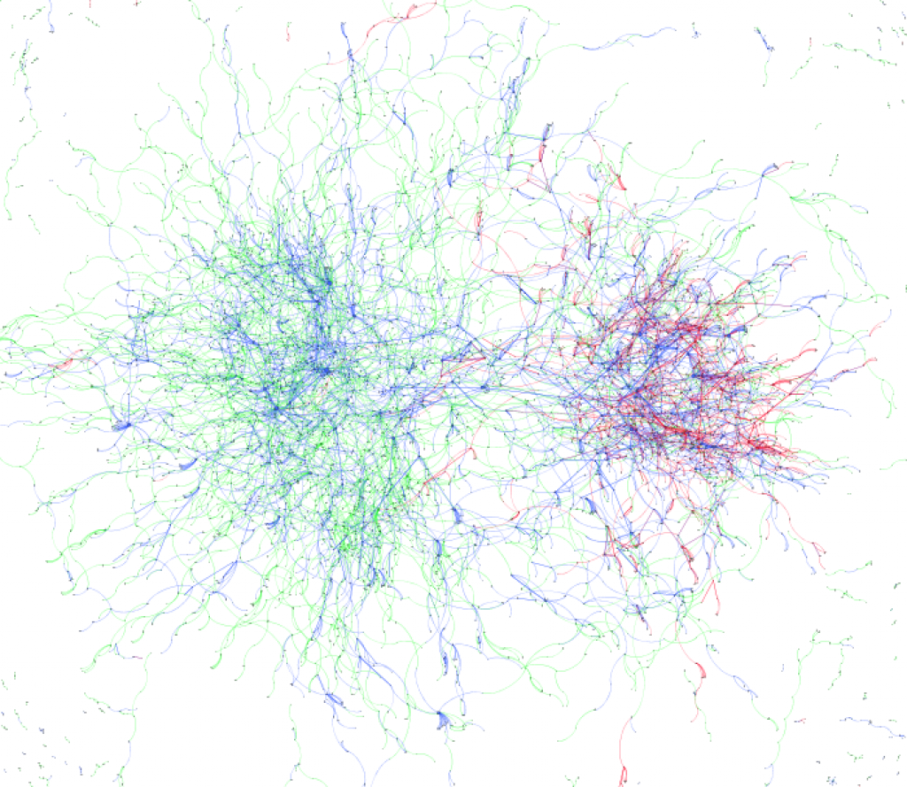

Свою работу мастера я решил посвятить графам, потому что во-первых мне показалось что в ТТУ я о них мало слышал, а во-вторых потому что моя [Работа бакалавра](Работа%20бакалавра.md) была связана с индексацией сети. 

Сначала я хотел отрисовать эстонский сегмент .ee доменов, но потом решил что можно переключиться на социальные сети и поизучать их особенности. Этому способствовало еще и то что я как раз разрабатывал местную социальную сеть для молодежи которая пользовалась популярностью. 

В это время мимо проносились интересные медиа события в другой социальной сети - Твиттере. Арабская весна в мире, выборы и скайп-падения в Эстонии.. Жаль что из-за большой ширины выбранной темы, не удалось именно эти темы исследовать более пристально.

В практической части я использовал [Gephi](https://gephi.org/) и написал свою библиотеку для рисования графов. Кажется изначальный код был в https://github.com/tot-ra/grapheon, конечной версии я не могу сейчас найти. Сейчас я бы наверно пользовался [d3](https://observablehq.com/collection/@d3/d3-force), хотя не уверен что она смогла бы выдержать такие масштабы.

Вы также можете помочь в [коллективном переводе работы на английский](https://docs.google.com/document/d/18JqjHNSY52hx2lx3wN8is5OQbeiiMLNqGXqNv1LzrvE/edit?hl=ru&authkey=CMKM94EF).  

Интересным результатом работы для меня была визуализация социальной сети pling.ee с сегрегацией по языку (русский и эстонский), отражающая предпочтения в сети.

- [**Визуализация эволюционных каскадов сообщений в социальных сетях с помощью силовых графов**](pdfs/Msc%20work.pdf) (pdf)
- [PDF Slides](./pdfs/presentation-111102103001-phpapp02.pdf)

Близкие работы:
- [Networks, Crowds, and Markets](../img/Networks,%20Crowds,%20and%20Markets.pdf)

<iframe width="100%" height="400" src="https://www.youtube.com/embed/OMg0e0k9X9A" title="Охотники за привидениями (и я магистр)" frameborder="0" allow="accelerometer; autoplay; clipboard-write; encrypted-media; gyroscope; picture-in-picture; web-share" referrerpolicy="strict-origin-when-cross-origin" allowfullscreen></iframe>